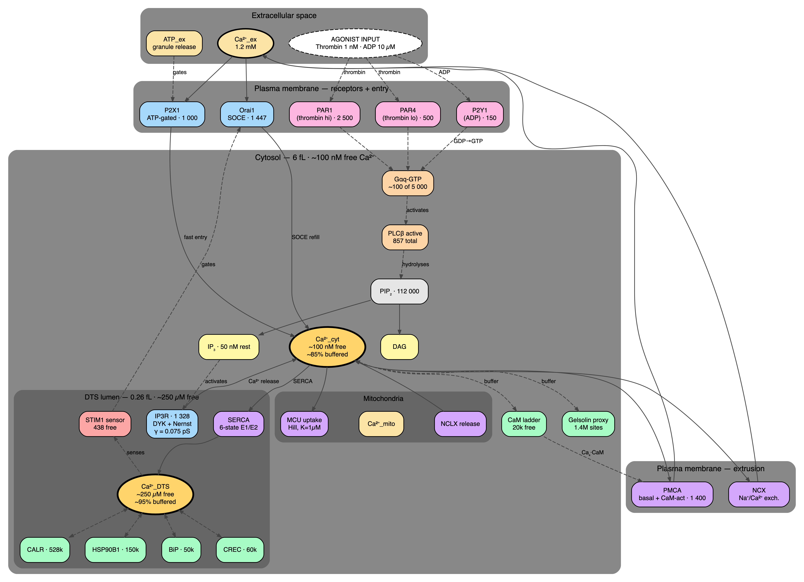
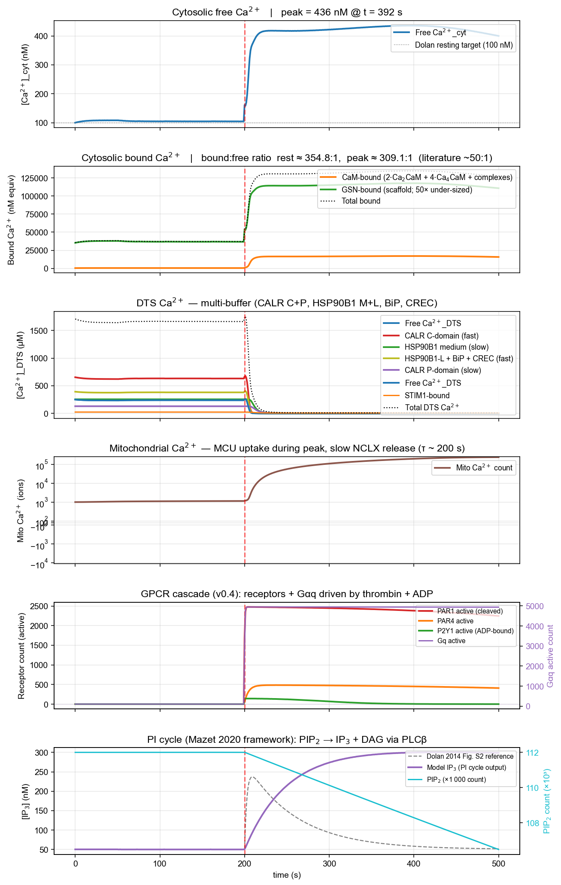

## The biological question

::: {.columns}
::: {.column width="60%"}

- Platelet activation in haemostasis (and in metastasis) is a **Ca²⁺ event**: cytosolic free Ca²⁺ rises from ~100 nM to ~1 µM within seconds of agonist binding.
- The Ca²⁺ comes from two places:
  - The **dense tubular system (DTS)** — the platelet's ER-equivalent, an internal store at ~250 µM.
  - The **extracellular space** — refill via store-operated entry.
- This rise drives shape change, granule release, αIIbβ3 activation — everything downstream.
- A whole-cell model lets us ask **why** the cell behaves this way, not just what.

:::
::: {.column width="40%"}

**Why model the whole pathway?**

Single mechanisms in isolation (one channel, one pump) tell you almost nothing — the biology is in the coupling. Resting state is a balance between ~12 simultaneous fluxes.

:::
:::

## Why wcEcoli — and not COPASI or SBML?

| Framework | Strength | Limitation |
|---|---|---|
| **COPASI** | Excellent ODE solver; SBML import; widely used for pathway models | Single-pathway, no copy-number accounting, no mass balance across compartments |
| **SBML / BioModels** | Curated catalogues of pathway models | Catalogues, not engines; each model in isolation |
| **wcEcoli** (Covert Lab, 2020) | The only **validated multi-process whole-cell model** — every protein counted, every reaction mass-balanced | E. coli-specific biology, large codebase (~80 kloc), unmaintained since 2022 |

**Decision:** fork wcEcoli, **prune all E. coli biology**, replace with platelet processes. Kept the simulation engine, state partitioning, listener/analysis framework. About 1 month of pruning before the first platelet sim ran.

## Process — how a biologist builds a calibrated model

::: {.columns}
::: {.column width="55%"}

**For each of the 12 mechanisms:**

1. **Anchor paper** — Dolan & Diamond 2014 (FP platelet model) supplied resting-state targets and the Fig. 4 validation experiment.
2. **Literature review** — primary kinetic studies (Caride 2007 for PMCA, Purvis 2008 for SERCA, deYoung-Keizer 1992 for IP3R…).
3. **Species** — list every Ca²⁺-binding protein state.
4. **Copy numbers** — Burkhart 2012 platelet proteome.
5. **Rate constants** — extracted from primary sources, with units, with citations.
6. **Sanity check** — does the resting state balance? Do the timescales line up?

:::
::: {.column width="45%"}

**The Purvis k₃ story (a sanity-check win):**

SERCA simulation diverged in seconds. Back-traced to one rate constant. The Purvis 2008 review had a typo — `k₃` was the *reciprocal* of the value in the primary source (Dode 2002 Table 1). Caught only by cross-checking the primary citation.

**Moral:** treat every value as a hypothesis. The literature has transcription errors. AI will not catch these for you.

:::
:::

## The model — 12 coupled mechanisms

## Validation — Dolan & Diamond 2014 Fig. 4

::: {.columns}
::: {.column width="55%"}

:::
::: {.column width="45%"}

**Phase 3 acceptance criteria: 5 / 5**

| Metric | Target | Model |
|---|---|---|
| Resting cyt | 100 ± 10 nM | 104 nM |
| Resting DTS | 250 µM | 235 µM |
| Resting IP₃ | 50 nM | 50 nM |
| Resting Gαq active | ~100 | 100 |
| 21/21 unit tests pass | — | ✓ |

**No hand-fitted forcing remains in the calcium path** — driven by physiological agonist concentrations (1 nM thrombin / 10 µM ADP) end-to-end.

:::
:::

## What's next

::: {.columns}
::: {.column width="50%"}

**Near-term (weeks):**

- **Granule release pipeline** — the model currently stops at the Ca²⁺ peak; v0.5 lets that peak *do something* (Ca²⁺-triggered exocytosis of dense and α-granules).
- **Long-recovery fix** — cytosolic Ca²⁺ collapses below 10 nM after sustained stimulation; deYoung-Keizer bistability artefact, fixable.
- **P2Y₁₂ / Gi pathway** — the inhibitory ADP arm (clopidogrel target), parallel to the Gq cascade already in place.

:::
::: {.column width="50%"}

**Long-term (cross-disciplinary):**

- **Platelet–tumour interactions.** Platelets cloak circulating tumour cells, shield them from shear stress and immune surveillance, and release growth factors. A calibrated platelet model coupled to a tumour-cell model is in principle achievable — relevant to this lab's metastasis work.
- **Kinetics-as-data** refactor — biology lives in TSVs, not Python, so collaborators contribute by editing tables.
- **Single-cell calibration framework** — same approach (anchor paper → species → rates → cross-check) generalises to other cell types.

:::
:::

## AI in academic work — what worked

- **Literature triage at scale.** Surveying 30+ papers for "is there a primary source for SERCA3b kinetics at 37 °C" went from a 2-day task to a 2-hour conversation.
- **Rate-constant extraction.** Reading PDFs, finding Table 1, normalising units. ~95% accurate (the other 5% is where the Purvis k₃ story lives — see next slide).
- **Code architecture.** Translating "here's the biology, build me a process class that fits the wcEcoli framework" into working code. Multi-day to multi-hour.
- **Documentation.** Living design docs and lab books kept in sync with the model state — would not exist without AI.
- **Diagram generation.** This deck's overview figure was produced from a one-paragraph description.

## AI in academic work — what to watch for

::: {.columns}
::: {.column width="55%"}

- **Confident hallucination of parameters.** AI will return a plausible-looking rate constant with a plausible-looking citation. The number may be invented. **Always cross-check against the primary source.**
- **Citation provenance is fragile.** "Caride 2007 says X" — verify by reading Caride 2007.
- **The k₃ story is the parable.** A real transcription error existed in the literature; the model failed; back-tracing caught it. AI would have happily reproduced the typo.
- **Treat AI like a smart undergraduate.** Useful, fast, eager to please — and will confidently produce wrong answers if you don't ask "where did that come from?"

:::
::: {.column width="45%"}

**Practical discipline:**

1. Every numerical value gets a primary citation in code comments.
2. Validation gates between every increment ("does the resting state still hold?").
3. Tests assert the things AI is most likely to silently break.
4. Lab books record the AI conversation context, not just the conclusion.

:::
:::

## About this deck

- Written as a Quarto markdown source — three pages of text + a YAML header — and rendered to PowerPoint via this template.
- **The template itself (`steve-academic-theme.pptx`) was designed by AI.** Brief: "academic, restrained, two-column-friendly, no clip art". Iterated over ~20 minutes.
- The Graphviz diagram on slide 4 was generated from a DOT source written in conversation with AI; same source produces SVG for BioRender import or PNG for slides.
- **The point:** the *tooling* around the science is now low-cost. The discipline of doing the science right — citations, validation, sanity checks — is where the human work has to live.
