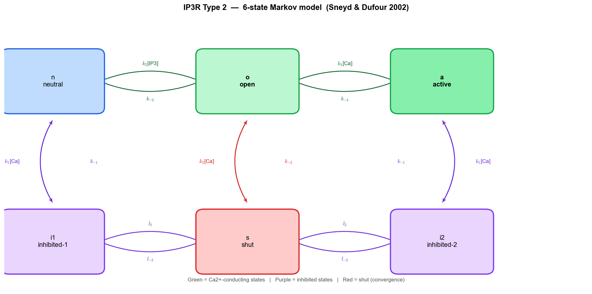
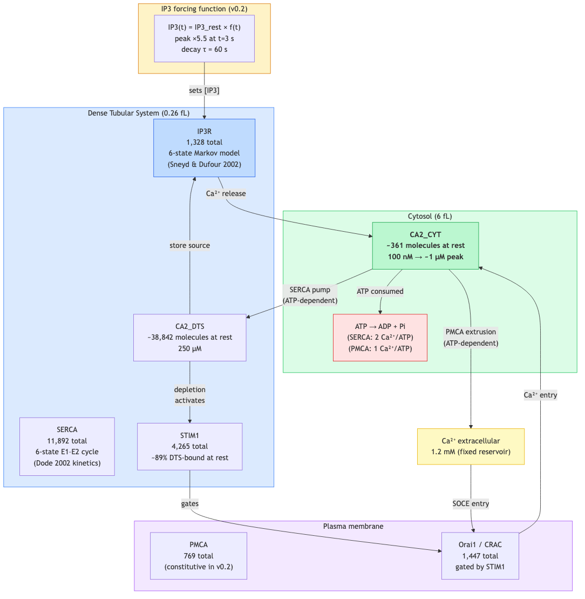
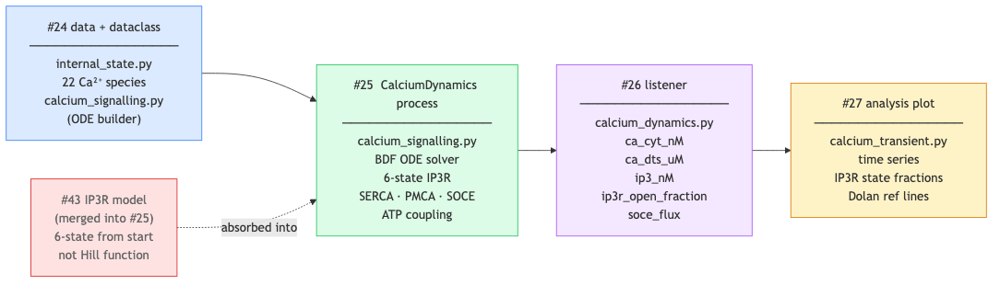

# v0.2 Calcium Dynamics — Design Document

**Issues:** #24 (data + dataclass), #25 (process), #26 (listener), #27 (analysis), #43 (IP3R model)
**Branch:** `platelet`
**References:** `reports/calcium-data-provenance.md`, `reports/calcium-signalling-pathway-design.md`

---

## 1. Scope

v0.2 adds the first real biochemistry to the platelet model: a Ca²⁺ transient
driven by IP3. The goal is to reproduce the Dolan & Diamond (2014) Figure 4
response curve — a sharp peak in cytosolic Ca²⁺ followed by a SOCE-sustained
plateau — using the same ODE parameters published in that paper.

This is a **Dolan-core-first** strategy:

```
v0.2:  IP3 forcing → Ca²⁺ core (IP3R + SERCA + PMCA + SOCE)
v0.3:  Upstream receptor cascade  (P2Y1 → Gq → PLCβ → IP3 production)
v0.4:  P2Y12 modulation           (Gi → AC → cAMP → PKA → IP3R inhibition)
```

Each milestone is independently testable and produces publishable results.

### 1.1 Framework usage philosophy

The Karr/wcEcoli framework is used here as a **software architecture scaffold**,
not as a source of biological processes. We carry over:

- Process / State / Listener base classes and the time-stepping loop
- `BulkMolecules` / `UniqueMolecules` state containers and partitioning
- `TableWriter` / `TableReader` columnar I/O
- The webapp, runscripts, and analysis infrastructure

We do **not** carry over any E. coli biological processes (transcription,
translation, metabolic network, DNA replication). Platelets are anucleate —
those processes don't exist. The platelet-specific processes are entirely new:
`CalciumDynamics` (v0.2), granule secretion, integrin signalling (future).
The E. coli model is a useful architectural template, not a biological one.

---

## 2. Signal pathway (brief)

See `reports/calcium-signalling-pathway-design.md` for the full biology.

At rest, cytosolic Ca²⁺ is ~100 nM, DTS Ca²⁺ is ~250 µM. On stimulation:

```
IP3 spike
  └─ IP3R (DTS membrane): opens → Ca²⁺ floods cytosol (peak ~400 nM)
       ├─ SERCA (DTS membrane): Ca²⁺-ATPase refills the DTS store
       ├─ PMCA (plasma membrane): Ca²⁺-ATPase ejects Ca²⁺ from cell
       └─ DTS depletion → STIM1 oligomerises → gates Orai1 → SOCE
```

Key compartments: cytosol (6 fL), DTS (0.26 fL = 4.3% cyt), extracellular (infinite reservoir).

---

## 3. ODE system

### 3.1 State variables and the integer-count problem

**Cytoplasmic Ca²⁺ is at the continuum limit.** At rest (~100 nM), the count
depends on which cytoplasmic volume we adopt:

| Source | V_cyt | Ca²⁺ at 100 nM | Ca²⁺ at peak (~1 µM) |
|--------|-------|----------------|----------------------|
| Purvis 2008 (direct measurement) | 6.0 fL | 361 | ~3,600 |
| Sveshnikova 2025 | 3.0 fL | 181 | ~1,800 |
| Minimum plausible | 2.0 fL | 120 | ~1,200 |

All three are borderline for deterministic treatment. For context, the rule of
thumb for Gillespie vs ODE is usually ~1,000 molecules — we are near or below
that at rest.

**Decision: deterministic ODE sub-stepper for v0.2.**

Rationale:
- Gillespie for Ca²⁺ dynamics is computationally impractical: the SERCA cycle
  has transitions with rates up to 1,000 s⁻¹ × 11,892 enzymes — the algorithm
  would fire millions of reaction events per simulated second.
- Tau-leaping (the standard Gillespie approximation) is a viable middle ground
  but adds significant implementation complexity for a first version.
- The ODE gives the correct *mean* behaviour. The quantisation noise when
  rounding back to integers is ~0.3–0.8% per timestep at resting concentrations
  — this is below biological measurement uncertainty.
- Both Purvis 2008 and Sveshnikova 2015 use stochastic simulation, but they
  focus on cell-to-cell variability in population studies. For single-cell
  mean dynamics (our validation target), deterministic ODEs are standard.

**Flag for v0.3:** once the upstream receptor module is added, the PLC-Gq
complex (~1 molecule at any time, Sveshnikova 2025) is a genuine stochastic
bottleneck that will require tau-leaping or a hybrid approach.

**Volume decision:** Use V_cyt = 6.0 fL (Purvis 2008, direct measurement).
This gives the most conservative count (~361 at rest) and is the basis for
the Dolan 2014 parameters we are adopting. Document the Sveshnikova discrepancy
in the analysis.

| Variable | Description | Compartment | Resting count |
|----------|-------------|-------------|---------------|
| `CA2_CYT` | Cytosolic free Ca²⁺ | `[c]` | **361** (100 nM, 6 fL cyt) |
| `CA2_DTS` | DTS stored Ca²⁺ | `[dts]` | 38,842 (250 µM, 0.26 fL DTS) |
| `CA2_EX` | Extracellular Ca²⁺ | `[e]` | fixed (infinite reservoir) |
| `IP3` | Inositol trisphosphate | `[c]` | 181 |
| `IP3R_n` | IP3R neutral state | `[dts]` | 809 |
| `IP3R_o` | IP3R open state | `[dts]` | 261 |
| `IP3R_a` | IP3R active state | `[dts]` | 65 |
| `IP3R_i1` | IP3R inhibited-1 state | `[dts]` | 167 |
| `IP3R_i2` | IP3R inhibited-2 state | `[dts]` | 25 |
| `IP3R_s` | IP3R shut state | `[dts]` | 1 |
| `SERCA_E1` | SERCA empty, E1 | `[dts]` | 5,920 |
| `SERCA_E2` | SERCA empty, E2 | `[dts]` | 5,927 |
| `SERCA_E1Ca` | SERCA·Ca²⁺ in E1 | `[dts]` | 6 |
| `SERCA_E1PCa` | SERCA phosphorylated·Ca²⁺ | `[dts]` | 7 |
| `SERCA_E2PCa` | SERCA phosphorylated E2·Ca²⁺ | `[dts]` | 4 |
| `SERCA_E2P` | SERCA phosphorylated, empty | `[dts]` | 28 |
| `PMCA` | PMCA unbound | `[m]` | 764 |
| `PMCA_Ca` | PMCA·Ca²⁺ complex | `[m]` | 4 |
| `STIM1` | STIM1 free monomer | `[dts]` | 438 |
| `STIM1_Ca` | STIM1 DTS-bound (inactive) | `[dts]` | 3,805 |
| `STIM1_dim` | STIM1 dimer (active sensor) | `[dts]` | 22 |
| `ORAI1` | Orai1 (closed) | `[m]` | 1,447 |

Initial counts from Dolan 2014 Table S1 representative configuration.
Conversion: 6 fL cytosol, 0.26 fL DTS, N_A = 6.022×10²³.

### 3.2 IP3 sourcing

In a whole-cell model, IP3 should be a state variable produced by the GPCR
cascade (P2Y1 → Gq → PLCβ → IP3) and consumed by IP3 phosphatase. In v0.2,
it is instead driven by an analytical forcing function — a known simplification.

This is acceptable for the Ca²⁺ core validation (reproducing Dolan Fig 4),
but it means **you cannot model agonist dose-response until v0.3**. The
forcing function shape is taken directly from Dolan 2014 Fig S2:

```
IP3(t) = IP3_rest × [1 + (fold−1) × (1 − e^{−t/τ_rise}) × e^{−max(0, t−t_peak)/τ_decay}]

fold     = 5.5   (peak amplitude relative to rest)
τ_rise   = 3.0 s
t_peak   = 3.0 s
τ_decay  = 60.0 s
```

The forcing function is injected into the ODE solver at each timestep as a
fixed boundary condition on IP3, not as a molecule count. IP3 is still tracked
as a BulkMolecule (for mass accounting), but its count is overridden by the
forcing function each step.

**v0.3 upgrade path:** Replace the forcing function with a proper upstream
process (`P2Y1Signalling`) that produces IP3 as a BulkMolecule. The Ca²⁺
process then reads IP3 as a normal state variable. No change to the Ca²⁺
ODE system is needed — IP3 concentration simply becomes time-varying input.

### 3.3 IP3R: 6-state Markov model (Sneyd & Dufour 2002)

The IP3 receptor transitions between six states. Ca²⁺-dependent activation
and inhibition produce the biphasic open probability required for oscillations.
A Hill function cannot reproduce this behaviour.


*Green states (o, a) are Ca²⁺-conducting. Transitions are Ca²⁺- and IP3-dependent.*

Rate constants (Purvis 2008 Table 1, Sneyd & Dufour 2002 type-2 kinetics):

| Transition | Forward | Reverse |
|------------|---------|---------|
| n ↔ o (IP3 binding) | k₂ = 37.4 µM⁻¹s⁻¹, l₄ = 1.7 µM⁻¹s⁻¹ | k₋₂ = 1.4 s⁻¹, l₋₄ = 2.5 µM⁻¹s⁻¹ |
| n ↔ i1 (Ca²⁺ inhibition) | k₁ = 0.64 µM⁻¹s⁻¹, L₁ = 0.12 µM | k₋₁ = 0.04 s⁻¹ |
| o ↔ a (Ca²⁺ activation) | k₄ = 4 µM⁻¹s⁻¹ | k₋₄ = 0.54 µM⁻¹s⁻¹ |
| o ↔ s (shutting) | k₃ = 11 µM⁻¹s⁻¹, L₅ = 54.7 µM | k₋₃ = 29.8 s⁻¹ |
| i1, i2 ↔ s | l₂ = 1.7 s⁻¹ | l₋₂ = 0.8 s⁻¹ |

Open probability:
```
P_o = (0.9 × IP3R_a / IP3R_total + 0.1 × IP3R_o / IP3R_total)⁴
```

Ca²⁺ flux through IP3R (Purvis 2008):
```
J_IP3R = γ_IP3R × N_IP3R × P_o × ψ_IM / (z × F)

γ_IP3R  = 10 pS     single-channel conductance
ψ_IM    = RT/zF × ln([Ca²⁺]_dts / [Ca²⁺]_cyt)   Nernst driving force (z=2)
```

### 3.4 SERCA: E1–E2 cycle

Six-state enzymatic cycle (Purvis 2008, Dode 2002):

```
E2 ⇌ E1 ⇌ E1·Ca²⁺ → E1P·Ca²⁺ ⇌ E2P·Ca²⁺ → E2P → E2
          ↑ (cytosol)                      ↓ (DTS)
```

Each cycle transports 2 Ca²⁺ ions from cytosol to DTS at the cost of 1 ATP.
Rate constants: see `calcium-data-provenance.md` § "SERCA cycle".

### 3.5 PMCA

Two-state simplified model (Caride 2007 parameters, Purvis 2008 Table 1):

```
PMCA + Ca²⁺_cyt ⇌ PMCA·Ca²⁺ → PMCA + Ca²⁺_ex

KM1 = 0.5 mM⁻¹,  KM2 = 1.0 mM⁻¹,  kcat = 8.9 s⁻¹
```

CaM-mediated activation is simplified in v0.2: PMCA treated as constitutively
active at basal rate. Full CaM kinetics deferred to v0.3.

### 3.6 SOCE (STIM1 / Orai1)

Dolan 2014 MWC allosteric model:

```
STIM1·Ca²⁺_dts ⇌ STIM1_free  (Ca²⁺ release from DTS-bound STIM1)
STIM1_free      ⇌ STIM1_dim   (dimerisation — active sensor)
STIM1_dim + Orai1 → STIM1·Orai1*  (CRAC channel opening)
Ca²⁺_ex  --Orai1*--> Ca²⁺_cyt     (Ca²⁺ entry)
```

Key parameter: DTS membrane potential V_IM = −60 mV (Dolan clustering analysis
shows SOCE-active configurations cluster at V_IM > −70 mV; use upper bound).

SOCE current:
```
I_SOC = g_SOC × P_open × (V_PM − E_Ca)
```

where E_Ca is the Ca²⁺ Nernst potential and g_SOC is set by the MWC model.

---

## 4. Architecture

### 4.1 Signal flow


*ATP coupling shown in red. Green compartment = cytosol, blue = DTS, purple = plasma membrane.*

### 4.2 File structure


*Issue #43 (IP3R model upgrade) is absorbed into #25 — 6-state model is implemented from the start.*

### 4.3 File contents

#### `reconstruction/platelet/dataclasses/process/calcium_signalling.py`

Builds the ODE system at "parameter-fitting" time (called once on startup, not
each timestep). Exposes a `molecules_to_next_time_step()` method.

```python
class CalciumSignalling:
    molecule_names: list[str]

    def __init__(self, raw_data, sim_data):
        # Phase 1: hardcoded species and rate constants (see §5)
        # Phase 2 migration: swap in TSV parsing here
        ...

    def molecules_to_next_time_step(
            self, counts, volume_cyt, volume_dts, nAvogadro, dt, t_sim
    ) -> tuple[np.ndarray, np.ndarray]:
        """Integrate Ca2+ ODEs for one timestep.

        Returns (needed, changes) as integer count deltas.
        """
        y0 = counts / (volume * nAvogadro)   # counts → µM
        # Inject IP3 forcing function at current simulation time
        # Solve with scipy.integrate.solve_ivp (BDF, stiff)
        # Round back to integers
        ...
```

#### `models/platelet/processes/calcium_signalling.py`

Thin wrapper. Note ATP coupling in both lifecycle methods:

```python
class CalciumDynamics(process.Process):
    _name = "CalciumDynamics"

    def initialize(self, sim, sim_data):
        super().initialize(sim, sim_data)
        self.solver = sim_data.process.calcium_signalling
        self.molecules = self.bulkMoleculesView(
            sim_data.process.calcium_signalling.molecule_names)
        # ATP accounting
        self.atp = self.bulkMoleculesView(['ATP[c]'])
        self.adp = self.bulkMoleculesView(['ADP[c]'])
        self.pi  = self.bulkMoleculesView(['Pi[c]'])

    def calculateRequest(self):
        counts = self.molecules.total_counts()
        t_sim  = self.time()
        cellMass = (self.readFromListener("Mass", "cellMass") * units.fg
                    ).asNumber(units.g)
        volume_cyt = cellMass / self.cellDensity

        self.needed, self.changes, self.atp_needed = (
            self.solver.molecules_to_next_time_step(
                counts, volume_cyt, self.nAvogadro, self.timeStepSec(), t_sim))

        self.molecules.requestIs(self.needed)
        self.atp.requestIs(np.array([self.atp_needed]))

    def evolveState(self):
        self.molecules.countsInc(self.changes)
        # Consume ATP, return ADP + Pi (use actual allocated, not requested)
        atp_used = min(self.atp.counts()[0], self.atp_needed)
        self.atp.countsDec(np.array([atp_used]))
        self.adp.countsInc(np.array([atp_used]))
        self.pi.countsInc( np.array([atp_used]))
```

#### `models/platelet/listeners/calcium_dynamics.py`

Records each timestep:

| Column | Description |
|--------|-------------|
| `ca_cyt_nM` | `CA2_CYT[c]` count converted to nM |
| `ca_dts_uM` | `CA2_DTS[dts]` count converted to µM |
| `ip3_nM` | IP3 count converted to nM |
| `ip3r_open_fraction` | `(IP3R_o + IP3R_a) / IP3R_total` |
| `soce_flux` | estimated Orai1 current (µM/s) |

---

## 5. Parameter and initial condition table

Full provenance in `calcium-data-provenance.md`. Summary for implementation:

### Volumes

| Compartment | Value | Source |
|-------------|-------|--------|
| Cytosol | 6.0 fL | Purvis 2008 (direct measurement) |
| DTS | 0.258 fL (4.3% × cyt) | Purvis 2008 glucose-6-phosphatase stain |
| Extracellular | infinite (fixed reservoir) | — |

### Resting concentrations

| Species | Conc | Count (calc) | Source |
|---------|------|-------------|--------|
| Ca²⁺_cyt | 100 nM | 361 | Purvis 2008 |
| Ca²⁺_dts | 250 µM | 38,842 | Dolan 2014 Fluo-5N measurement |
| Ca²⁺_ex | 1.2 mM | fixed | Dolan 2014 |
| IP3 | 50 nM | 181 | Sveshnikova 2025 / Dolan 2014 middle |
| IP3R total | — | 1,328 | Dolan 2014 Table S1 |
| SERCA total | — | 11,892 | Dolan 2014 Table S1 |
| PMCA total | — | 769 | Dolan 2014 Table S1 |
| STIM1 total | — | 4,265 | Dolan 2014 Table S1 |
| Orai1 total | — | 1,447 | Dolan 2014 Table S1 |

### Key physical constants

| Constant | Value |
|----------|-------|
| N_A | 6.022×10²³ mol⁻¹ |
| V_IM (DTS membrane potential) | −60 mV (Dolan upper bound) |
| V_PM (plasma membrane potential) | −60 mV |
| T | 310 K (37°C) |

---

## 6. Implementation decisions

### 6.1 ODE state vs BulkMolecules

**Decision:** ODE solver works in concentration (µM) internally. At the start
of each timestep, integer counts are converted to concentration, integrated,
then rounded back to counts. This matches the TwoComponentSystem pattern.

**Implication:** At resting cytosolic Ca²⁺ (~361 molecules), rounding
introduces ~0.3% quantisation noise per step. This is acceptable —
Sveshnikova 2015 notes that stochastic effects at this scale are biologically
real. We accept it and flag it in the analysis.

### 6.2 One process or many?

**One process.** The Ca²⁺ subsystem is tightly coupled — splitting IP3R,
SERCA, and SOCE across processes would require artificial partitioning at
every interface. The ODE captures this coupling naturally. This mirrors the
TwoComponentSystem design decision.

### 6.3 IP3R model: Hill vs 6-state?

**6-state from the start.** The Sneyd & Dufour model is the consensus
implementation in Purvis 2008 and Dolan 2014. Ca²⁺ oscillations — a key
validation target — require the biphasic Ca²⁺-dependent gating that only the
6-state model provides. Issue #43 (previously flagged as an upgrade) is
therefore merged into #25 and implemented in the initial version.

### 6.4 Extracellular Ca²⁺

Treated as a fixed reservoir (1.2 mM; Dolan 2014). Not stored in
BulkMolecules — just a constant in the SOCE and PMCA rate equations.
This is the standard simplification in all reference models.

### 6.5 ATP coupling

**SERCA and PMCA are ATPases. ATP must be accounted for.**

The framework explicitly tracks ATP/ADP via `BulkMolecules`. The Ca²⁺ process
must request ATP in `calculateRequest()` and return ADP + Pi in `evolveState()`.
Ignoring this breaks the whole-cell energy budget.

Stoichiometry:
- **SERCA**: 1 ATP → 2 Ca²⁺ transported (cytosol → DTS)
- **PMCA**: 1 ATP → 1 Ca²⁺ extruded (cytosol → extracellular)

At each timestep, the ODE integration gives us the net Ca²⁺ transport:
```
Δca_serca = CA2_DTS[t+dt] - CA2_DTS[t] + (net DTS leak flux)
Δca_pmca  = Ca²⁺ extruded (from PMCA flux integral)

ATP_consumed = floor(Δca_serca / 2) + Δca_pmca
```

At rest, SERCA and passive leak are in balance — net ATP consumption is small.
During a Ca²⁺ transient, SERCA works hard to refill the DTS, and the ATP drain
will be visible in the mass listener as a metabolic signature of activation.
This is a useful emergent property: it means platelet activation shows up
correctly as an energy cost without any special-casing.

In v0.2, ATP is added to the molecule inventory and the process requests it.
If the ATP pool is insufficient (unlikely in the first version), we log a
warning and proceed without it — this failure mode will motivate adding a
proper metabolic process in a future milestone.

```python
def calculateRequest(self):
    counts = self.molecules.total_counts()
    # ... run ODE solver ...
    self.needed, self.changes = self.solver.molecules_to_next_time_step(...)

    # Request ATP for pump activity
    self.atp_needed = self.solver.estimate_atp_cost(self.changes)
    self.atp.requestIs(self.atp_needed)

    self.molecules.requestIs(self.needed)

def evolveState(self):
    # Apply Ca²⁺ changes
    self.molecules.countsInc(self.changes)
    # Consume ATP, produce ADP + Pi
    atp_allocated = self.atp.counts()[0]
    self.atp.countsDec(atp_allocated)
    self.adp.countsInc(atp_allocated)
    self.pi.countsInc(atp_allocated)
```

### 6.6 ODE solver

`scipy.integrate.solve_ivp` with method `'BDF'` (backward differentiation,
suitable for stiff systems). Tolerances: `atol=1e-10`, `rtol=1e-8`.
Ca²⁺ transients resolve on 1–3 s timescale; 1-second timestep is adequate.

### 6.7 Not backing into a corner

The hardcoded parameter approach (Milestone 1) is identical to the TSV-based
approach from the Process's point of view. The only change for Milestone 2 is
swapping the two assignment lines in the dataclass `__init__`. See
`calcium-signalling-pathway-design.md` §"Milestone 1 shortcut" for the exact
migration pattern.

---

## 7. Validation strategy

### 7.1 Resting state stability (first test, no stimulus)

Run 300 s with no IP3 forcing (fold=1). Pass criteria:
- Ca²⁺_cyt stays within 80–120 nM
- Ca²⁺_dts stays within 200–300 µM
- IP3R state fractions within 10% of Dolan Table S1 values

### 7.2 Ca²⁺ transient shape (primary validation)

Run 300 s with IP3 forcing (fold=5.5, τ_rise=3 s, τ_decay=60 s).
Pass criteria (Dolan 2014 Fig 4, +extracellular Ca²⁺ condition):
- Peak Ca²⁺_cyt: 200–500 nM, reached within 15–20 s
- Partial DTS depletion: Ca²⁺_dts drops to 30–70% of resting
- Sustained plateau above baseline (SOCE-dependent)
- Return to ~resting levels within 300 s

### 7.3 SOCE dependence

Run with Ca²⁺_ex = 0 (EDTA condition).
Pass criteria:
- Transient peak similar, but plateau absent / faster decay
- Matches Dolan 2014 Fig 4C (no-extracellular-Ca²⁺ curve)

### 7.4 Analysis plot (`calcium_transient.py`)

- Time series: Ca²⁺_cyt (nM), Ca²⁺_dts (µM) on dual axes
- Inset: IP3R open fraction over time
- Annotation: forcing function equation, Dolan 2014 reference values as dashed lines
- Second panel: IP3R state fractions stacked area chart

---

## 8. Issue tracking

| Issue | Title | Deliverables |
|-------|-------|-------------|
| **#24** | Ca²⁺ data and dataclass | `internal_state.py` (22 species), `calcium_signalling.py` dataclass, `dts` compartment |
| **#25** | CalciumDynamics process | `calcium_signalling.py` process, ODE solver, 6-state IP3R, SERCA, PMCA, SOCE, IP3 forcing |
| **#26** | Ca²⁺ listener | `calcium_dynamics.py` listener recording 5 columns per timestep |
| **#27** | Ca²⁺ analysis plot | `calcium_transient.py` — transient shape, IP3R states, dual-axis, Dolan reference lines |
| **#43** | ~~IP3R upgrade~~ | Merged into #25 — 6-state model implemented from the start |

---

## 9. Open questions for review

1. **DTS volume:** Use 4.3% of cytosol (Purvis direct measurement, 0.26 fL) or 2%
   (Purvis Monte Carlo median, 0.12 fL)? The larger DTS gives a larger Ca²⁺ store
   and more stable oscillations. **Recommendation: 4.3%.**

2. **Cytoplasmic volume:** Use 6 fL (Purvis) or 3 fL (Sveshnikova)? This directly
   sets the resting Ca²⁺ count: 361 vs 181. Either is borderline for deterministic
   treatment. **Recommendation: 6 fL to stay consistent with Dolan 2014 parameters.**
   The Sveshnikova discrepancy likely reflects a different definition of "cytoplasm"
   (total cell vs non-granular fraction). Document in the analysis.

3. **V_IM:** Set to −60 mV (Dolan cluster analysis upper bound). If SOCE flux is
   too large or too small, this is the first parameter to adjust.

4. **IP3R copy number:** Use Dolan 2014 Table S1 value (1,328) rather than Burkhart
   proteomics sum (4,850). Rationale: not all proteomic copies are in the DTS
   membrane and functionally gated. The Dolan value is from a filtered population
   that satisfies homeostatic constraints.

5. **CaM / PMCA activation:** Simplify to constitutive PMCA in v0.2. Full CaM
   kinetics in v0.3. Agree?

6. **ATP molecule inventory:** ATP, ADP, Pi must be added to the platelet molecule
   inventory to support pump accounting. Starting counts: ATP ~10⁹ (Platelet
   contains ~10⁻¹² mol ATP, Gerson 2008). Confirmed approach?

7. **Stochastic future (flagged, not blocking):** The PLC-Gq bottleneck (~1 molecule)
   will require a hybrid deterministic/stochastic approach in v0.3. At that stage,
   the upstream module should use tau-leaping (Gillespie approximation) while the
   Ca²⁺ ODE core remains deterministic. This is a known architectural choice, not
   a v0.2 concern.

---

*Document status: DRAFT — for review before implementation*
