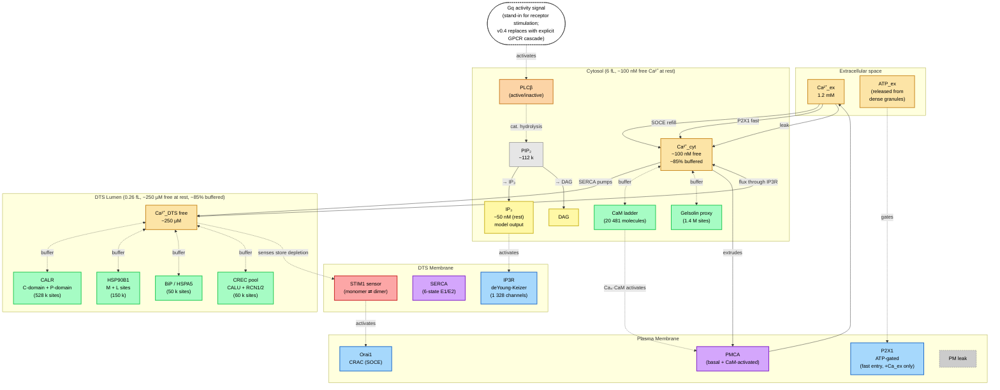
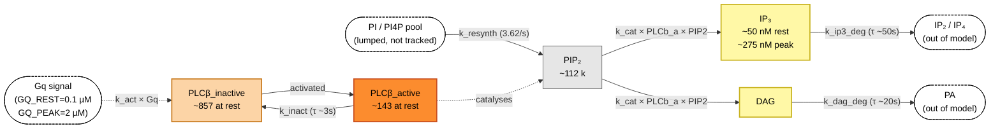
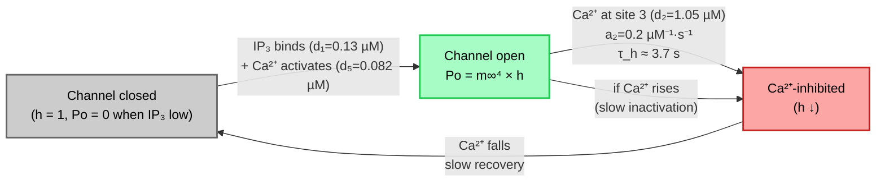
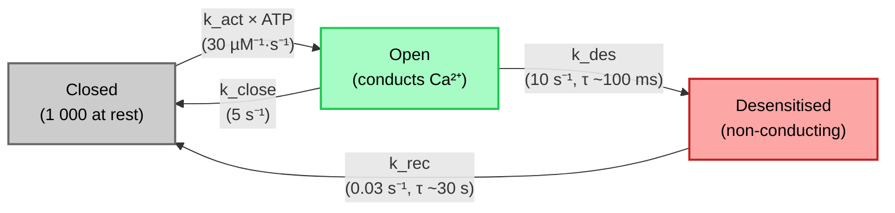
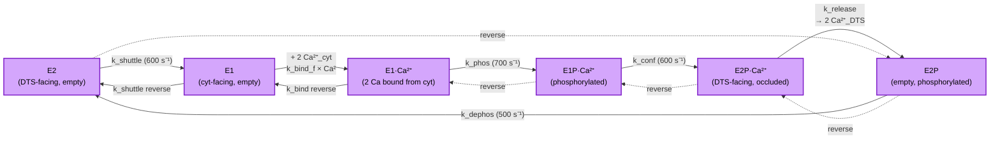
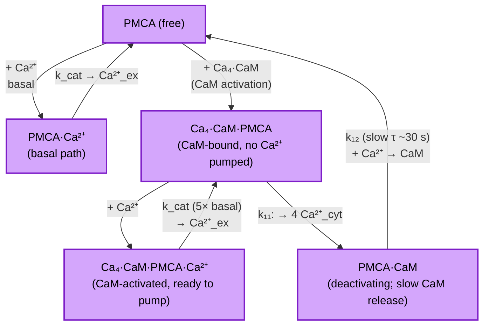
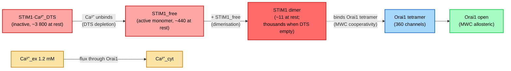

# Platelet WCM — Ca²⁺ pathway diagrams (v0.3.0)

Mermaid versions of the ASCII diagrams in `biology-overview-2026-05-07.md`.
GitHub renders these natively; locally try the VS Code Mermaid plugin.

Updated 2026-05-12 (post Phase 4 / #31 — PI cycle replaces forced IP3).

---

## 1. Full Ca²⁺ pathway — top-level architecture

**Reading the diagram:**
- Solid arrows = Ca²⁺ flux
- Dashed double arrows = reversible binding (buffers)
- Dotted arrows = regulatory / activation (not Ca²⁺ flow)
- Eight coupled mechanisms — PI cycle generates IP₃ → IP3R releases DTS Ca²⁺ → cyt buffers absorb → SERCA and PMCA extrude → SOCE / P2X1 refill from outside.

---

## 2. PI cycle (Mazet 2020 framework) — replaces forced IP3

**Key idea**: the Gq signal (currently a forced curve, replaced by
explicit receptor cascade in v0.4) activates PLCβ; active PLCβ
catalyses PIP₂ → IP₃ + DAG; IP₃ feeds the IP3R; DAG is currently
unused but kept for future PKC modelling.

---

## 3. IP3R deYoung-Keizer / Li-Rinzel model

`h` is the slow inactivation variable; m∞ is quasi-steady (fast).
Tetrameric cooperativity → Po = m∞⁴ × h. Flux through the open
channel is Nernst-based: I = γ × N × Po × (ψ_IM − E_Ca,IM) × NA/(zF),
with γ = 0.075 pS (calibration anchor).

---

## 4. P2X1 — 3-state ATP-gated channel

Ca²⁺ flux through the Open state is **gated on extracellular Ca²⁺
availability** — in the EDTA (−Ca_ex) condition, the channel still
cycles through C → O → D but contributes no Ca²⁺. This is what
produces the SOCE differential in the Phase 3 ±Ca_ex comparison.

---

## 5. SERCA E1/E2 cycle (6 states, 2 Ca²⁺ per cycle)

Solid arrows = forward cycle (cyt → DTS pumping); dashed = reverse.
At rest the cycle runs at ~14 k cycles/s × 2 Ca²⁺ = ~28 k Ca²⁺/s.

---

## 6. PMCA — Caride 2007 5-state CaM-coupled scheme

Two pumping paths: basal (slow, runs at all Ca²⁺) and CaM-activated
(5× faster, requires Ca₄·CaM binding). Step 11 releases 4 Ca²⁺ from
the CaM back to cyt during deactivation; step 12 is the slow CaM
unbinding.

---

## 7. STIM1 / Orai1 SOCE

Store-operated entry. As DTS [Ca²⁺] drops during the transient, STIM1
releases its Ca²⁺ → dimerises → binds Orai1 → CRAC channel opens →
Ca²⁺ flows in from outside. Slow (>10 s timescale) — too slow to
contribute to the early cyt peak, which is what P2X1 covers.

---

## BioRender assembly guide

These diagrams are good for the design/code documentation. For
**dissertation / publication figures**, BioRender is the standard.
Suggested asset/template search terms (icon name, where it would
slot into the diagrams above):

### Top-level pathway (diagram 1)
- "platelet" — template / cell outline
- "endoplasmic reticulum" / "DTS tubule" — for the DTS compartment (DTS is the platelet equivalent of the smooth ER; can use ER imagery)
- "plasma membrane" — bilayer
- "IP3 receptor" / "IP3R" — for the DTS membrane channel
- "SERCA" / "Ca²⁺ ATPase" — for the SERCA pump
- "PMCA" — plasma membrane Ca²⁺ ATPase
- "Orai1" / "CRAC channel" — for the SOCE channel
- "STIM1" / "stromal interaction molecule" — DTS Ca²⁺ sensor
- "P2X receptor" — ATP-gated cation channel
- "calmodulin" — CaM (often shown as dumbbell shape with two Ca²⁺-binding lobes)
- "gelsolin" — Ca²⁺-regulated actin-severing protein
- "calreticulin" — ER luminal buffer
- "calcium ion" / "Ca²⁺" — Ca²⁺ symbol

### PI cycle (diagram 2)
- "PLC beta" / "phospholipase C" — PLCβ
- "PIP2" / "phosphatidylinositol 4,5-bisphosphate" — substrate
- "IP3" / "inositol trisphosphate" — second messenger
- "DAG" / "diacylglycerol" — co-product
- "G alpha q" / "Gαq" — receptor-activated G-protein

### Suggested layout
1. Draw the platelet outline; place SCS (surface-connected canalicular system, distinct from DTS — visible as PM invaginations) and DTS as separate internal structures.
2. PM populated with: P2X1, Orai1, PMCA, and (implicit) the basal leak. Show the SCS as PM extensions.
3. DTS membrane: IP3R, SERCA, STIM1.
4. DTS lumen: free Ca²⁺ + buffer proteins (CALR with C/P domains, HSP90B1, BiP, CREC).
5. Cytosol: free Ca²⁺ + CaM (3 states) + gelsolin + PI cycle (PIP2 → PLCβ → IP3 + DAG).
6. Arrows in Ca²⁺-flux convention: brown/orange for Ca²⁺ ions; dashed for regulatory.

The BioRender search tools (see code-overview for accessing the
Anthropic MCP integration) can help find these assets.
