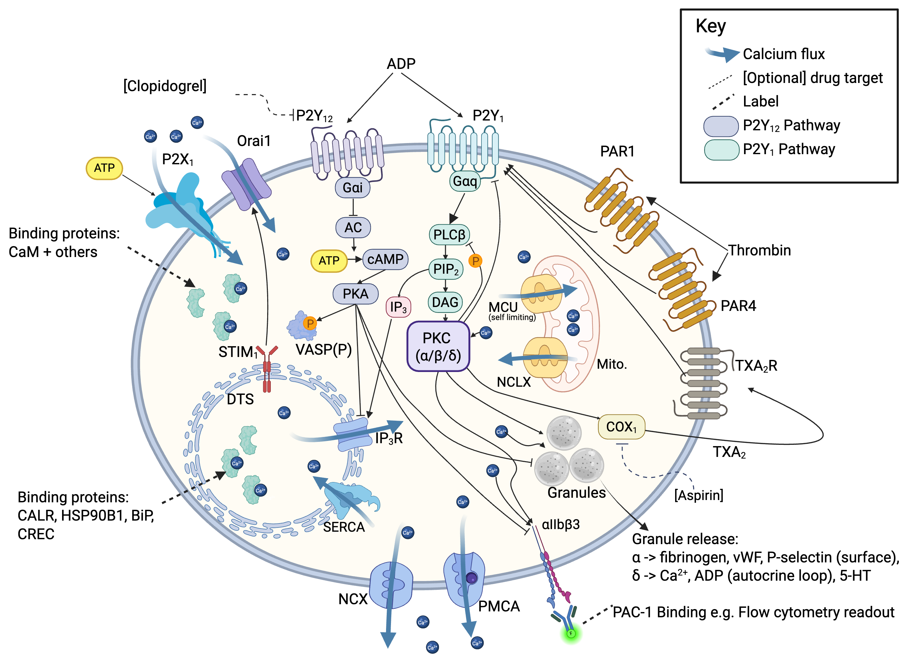

## Purpose and scope

This is a **reference document** for the v0.7 platelet calcium-signalling
network diagram (@fig-pathway). It walks the figure component by component and,
for each, states (i) the biological role, (ii) the governing equation(s) **exactly
as implemented**, (iii) the rate constants with their numeric values, units and
source, and (iv) which model state variable(s) the term touches and whether it
feeds back into the calcium ODE or is a terminal output.

Every equation and rate constant below is taken straight from the model's source
code, so this document describes what the simulation actually computes rather
than an idealised account of the biology.

The model represents the platelet's calcium chemistry as a system of **ordinary
differential equations (ODEs)**. There is one equation for each molecular
species, and it gives the rate at which that species' concentration changes as
the reactions drawn in @fig-pathway proceed. A numerical solver advances all of
the equations together, in steps of one second, and the calcium time-courses it
produces are what the model is tested against. The equations live in two places
in the code:

- **The calcium ODE itself** is in
  `reconstruction/platelet/dataclasses/process/calcium_signalling.py`. A single
  function, `_ode_rhs`, returns the rate of change of every species at a given
  instant (in the vocabulary of differential equations, the "right-hand sides")
  for the 58 species the model tracks. The solver calls it over and over to step
  the cell forward in time. Its rate constants are not written into the code;
  they are read at start-up from a separate parameter file,
  `reports/params/calcium-v0.6.toml`. (TOML is a plain-text format for
  configuration files. Each bracketed name in it, such as `[ip3r.channel]`,
  labels a group of related constants, and the `TOML […]` citations below point
  into those groups.)
- **Three downstream processes** read the calcium state once per second and act
  on it: `granule_secretion.py`, `thromboxane_synthesis.py` and
  `integrin_activation.py`, in `models/platelet/processes/`, with their
  parameters alongside the calcium code. Two of them feed a signal back into the
  ODE, the autocrine ADP and thromboxane loops; the third, integrin activation,
  is a pure read-out.

Line numbers refer to the code as committed on 24 June 2026 (commit `4fe847b9`).
Where a constant is a calibration or modelling choice rather than a measured
value, the text says so. As a rule, the receptor copy numbers are measured and
the rate constants are calibrated.

{#fig-pathway width=100%}

### Reading the diagram

Stepping through @fig-pathway:

- **Gq / P2Y1 arm (green).** Agonists ADP (P2Y1), thrombin (PAR1, PAR4) and
  autocrine TXA₂ (TP) → **Gαq** → **PLCβ** → PIP₂ → **IP₃ + DAG** → **IP₃R**-mediated
  Ca²⁺ release from the dense tubular system (DTS). *(→ §A–E.1)*
- **Gi / P2Y12 arm (purple).** ADP on **P2Y12** → **Gαi** → ↓adenylyl cyclase →
  ↓**cAMP** → ↓**PKA**, relieving the PKA brake on IP₃R, integrin and secretion.
  VASP-phosphorylation (VASP-P) is the clinical readout; **clopidogrel** blocks
  P2Y12. *(→ §A.5)*
- **Direct Ca²⁺ entry.** The ionotropic **P2X1** channel (top-left, ATP-gated)
  admits Ca²⁺ directly — no G protein, so no cascade arrow leaves it. *(→ §A.2)*
- **Cytosolic Ca²⁺ handling.** **SERCA** refills the DTS; **PMCA** and **NCX**
  extrude to the outside; **STIM1/Orai1** give store-operated entry (SOCE);
  mitochondrial **MCU/NCLX** exchange buffers the transient. *(→ §E–G.1)*
- **Buffers.** DTS luminal proteins (CALR, HSP90B1, BiP, CREC) and cytosolic
  **CaM** buffer free Ca²⁺. *(→ §G.2)*
- **PKC hub & outputs.** DAG + Ca²⁺ → **PKC (α/β/δ)**, which brakes the Gq cascade
  (P2Y1 desensitisation, PLCβ phosphorylation) and drives three **terminal
  outputs**: granule release (dense δ — Ca²⁺/ADP/5-HT, incl. the autocrine ADP
  loop; α — fibrinogen/vWF/P-selectin surface exposure), thromboxane synthesis
  (COX-1; **aspirin** target), and αIIbβ3 inside-out activation (the PAC-1
  flow-cytometry readout, driven via PI3K/Akt → Rap1b). *(→ §D, G.3–G.5)*
- **Optional drug targets (dashed lines in the figure).** clopidogrel (P2Y12),
  aspirin (COX-1).

---

## Model architecture & conventions

**Integration.** The ODE is integrated with
`scipy.integrate.solve_ivp(..., method='BDF', atol=1e-3, rtol=1e-6, max_step=dt)`
over a 1 s outer step (`calcium_signalling.py:1535–1542`). State is carried as
integer-equivalent **counts**; each rate law converts to µM internally.

**Compartment volumes & unit conversion** (lines 61–80):

| Symbol | Value | Meaning | Source |
|---|---|---|---|
| `V_CYT_L` | $6.0\times10^{-15}$ L | cytosol | Purvis 2008 |
| `V_DTS_L` | $0.258\times10^{-15}$ L | DTS (4.3 % of cytosol) | Purvis 2008 |
| `V_EX_L` | $6.64\times10^{-14}$ L | pericellular (~66 fL) | autocrine calibration |
| `N_A` | $6.022\times10^{23}$ | Avogadro | — |

$$\text{conc}_{\mu M} = \frac{\text{count}}{N_A\, V_L\, 10^{-6}}\quad(\texttt{\_UM\_PER\_COUNT\_CYT/DTS/EX})$$

**Physical constants** (lines 215–234). These are the standard thermodynamic
quantities that set the scale of the electrical forces on Ca²⁺. None is fitted:

| Symbol | Value | Meaning |
|---|---|---|
| $F$ | $96{,}485$ C/mol | **Faraday constant** — the electric charge of one mole of monovalent ions; it converts between an electric current and a rate of ion movement. |
| $R$ | $8.314$ J/(mol·K) | **universal gas constant**. |
| $T$ | $310$ K | **absolute temperature** (37 °C, body temperature). |
| $z$ | $2$ | the **charge number** of a Ca²⁺ ion (it carries two positive charges). |

Together these give the thermal voltage $RT/zF \approx 0.0133$ V, the natural
unit in which the membrane driving force on a Ca²⁺ ion is measured at body
temperature.

The two membranes are held at fixed voltages: $V_{IM} = 0$ V across the DTS
membrane and $V_{PM} = -0.060$ V across the plasma membrane (Dolan 2014). Each
ion channel (P2X1, IP₃R, SOCE) lets Ca²⁺ move down its electrochemical gradient,
so its flux follows a Nernst driving force,

$$J = -\,\gamma_s\,N\,P_o\,(V_m - E_{Ca})\,\frac{N_A}{zF},$$

where $\gamma_s$ is the conductance of a single open channel, $N$ the number of
channels, $P_o$ the fraction of them open, and $V_m$ the membrane voltage. The
Ca²⁺ reversal (Nernst) potential,

$$E_{Ca} = \frac{RT}{zF}\,\ln\frac{[\mathrm{Ca}]_\text{out}}{[\mathrm{Ca}]_\text{in}},$$

is the voltage at which the electrical and concentration forces on Ca²⁺ cancel:
the flux is zero when $V_m = E_{Ca}$ and grows as the membrane voltage departs
from it.

**The state vector** is the full list of quantities the model carries through
time: the 58 numbers (`N_SPECIES = 58`) that together fix the platelet's
signalling state at any instant. Each is the amount of one molecular species in
one compartment, and each has its own differential equation. They fall into a few
functional groups:

- **Free calcium** in the compartments that matter for signalling: the cytosol
  (`CA2_CYT[c]`) and the dense tubular system, which is the platelet's internal
  Ca²⁺ store (`CA2_DTS[dts]`). Mitochondrial Ca²⁺ is tracked separately.
- **The second messengers** of the Gq cascade: IP₃, DAG, and their membrane
  precursor PIP₂.
- **The receptors**, each split into the conformational pools that its equations
  shuttle molecules between: P2X1, P2Y1, PAR1, PAR4, P2Y12, and the thromboxane
  receptor TP.
- **The signalling enzymes and their internal states**: the Gαq pool; PLCβ
  (inactive, active, or phosphorylated); PKC (inactive or active); the IP₃R
  inactivation gate `IP3R_h`; the six enzymatic states of the SERCA pump; the
  basal and calmodulin-coupled states of the PMCA pump; and the store-operated
  entry machinery, STIM1 (free, Ca²⁺-bound, or dimerised) and Orai1.
- **The calcium buffers** that mop up free Ca²⁺: calmodulin (CaM, in its free,
  Ca₂- and Ca₄-bound forms) in the cytosol, and the luminal proteins of the DTS
  (CALR, HSP90B1, BiP, CREC, GSN).
- **The inhibitory arm and its read-outs**: cAMP, and the phosphorylation marker
  VASP.

(The species names themselves are listed in `MOLECULE_NAMES`, lines 105–199.)

### Notation — how to read the equations

The equations throughout share a small, consistent vocabulary described below.

| Symbol | Read as | Meaning |
|---|---|---|
| $\dot x$ (e.g. $\dot C$, $\dot O$, $\dot{R_a}$, $\dot{\mathrm{IP3}}$) | "$x$-dot" | **Time derivative** $dx/dt$ — the instantaneous rate of change of state variable $x$. The ODE solver integrates these over each 1 s step. Units: (count or µM) per second. |
| $v_\text{name}$ (e.g. $v_\text{on}$, $v_\text{act}$, $v_\text{cat}$, $v_\text{bind}$) | "V-name" | A **reaction velocity / flux term** — one signed contribution to a $\dot x$. Each $\dot x$ is a sum of $v$'s (e.g. $\dot{R_a}=v_\text{on}-v_\text{off}-v_\text{des}$ means $R_a$ gains at rate $v_\text{on}$, loses at $v_\text{off}+v_\text{des}$). Units match the $\dot x$ it feeds. |
| $J_\text{name}$ (e.g. $J_\text{P2X1}$, $J_\text{IP3R}$, $J_\text{SOCE}$) | "J-name" | A **membrane channel flux** specifically — Ca²⁺ ions/s through an ion channel, computed from a Nernst electrodiffusion driving force $-\gamma_s N P_o (V_m - E_{Ca})\,N_A/zF$ rather than mass-action. A $J$ is just a $v$ for a channel; the separate letter flags the electrodiffusive form. |
| $k_\text{name}$ (e.g. $k_\text{on}$, $k_\text{off}$, $k_\text{act}$, $k_\text{cat}$) | "K-name" | A **rate constant** — the fixed numeric coefficient multiplying reactant(s) in a $v$. These are the values in the per-section constant tables. Subscripts: `on`/`off` = binding/unbinding, `act`/`inact` = activation/inactivation, `cat` = catalytic turnover, `f`/`r` = forward/reverse, `deg` = degradation. |
| $C,\,O,\,D$ | closed / open / desensitised | The three **channel conformational states** (e.g. P2X1). |
| $R_i,\,R_a,\,R_\text{des},\,R_\text{int}$ | inactive / active / desensitised / internalised | **Receptor sub-pools**. A receptor's copies are partitioned across these; the $v$'s move copies between them. $R_a$ ("active") is the signalling pool that drives downstream G-protein activity. |
| $P_o$ | "P-oh" | **Open probability** — the fraction of a channel population open at a given instant (0–1); multiplies the maximal flux. |
| $m_\infty,\,h$ | — | **Gating variables** (IP₃R): $m_\infty$ is the fast activation gate at its quasi-steady value; $h$ is the slow Ca²⁺-dependent inactivation gate (its own ODE). |
| $b$ (e.g. $b_\text{ip3r}$, $b_\text{PKA}$) | brake | A dimensionless **brake multiplier**, normalised to 1.0 at rest; PKA raising it above/below 1 scales a target rate up/down. |
| $E_{Ca}$, $V_m$ | — | The Ca²⁺ **Nernst (reversal) potential** and the membrane potential of the compartment ($V_{IM}$ DTS, $V_{PM}$ plasma membrane). |
| "gate", $f_{Ca}$ | — | **Coincidence factors** in [0,1) — the shared PKC×Ca²⁺ gate (§D) and the Hill Ca²⁺ co-factor on PKC activation. |

A useful pattern: each block first lists the $\dot x$ balance equations (what
changes and in which direction), then defines each $v$ in that balance as a
mass-action product of a $k$ and its reactant state variables.

---

## A. Agonist inputs and receptors

### A.1 Agonist forcing time-courses

All three exogenous agonists share a rise-then-decay form with $t_\text{eff} = t -
\text{delay}$ (returns REST for $t_\text{eff}\le0$):

$$\text{value}(t) = \text{REST} + (\text{PEAK}-\text{REST})\,
\underbrace{(1-e^{-t_\text{eff}/\tau_\text{rise}})}_{\text{rise}}\;
\underbrace{e^{-\max(0,\,t_\text{eff}-t_\text{peak})/\tau_\text{decay}}}_{\text{decay}}$$

| Agonist | fn / lines | REST | PEAK | $\tau_\text{rise}$ | $t_\text{peak}$ | $\tau_\text{decay}$ |
|---|----|---|---|---|---|---|
| Thrombin (nM) | `thrombin_nM` 707–717 | 0 | 1.0 | 0.5 s | 5 s | 120 s |
| ADP (µM) | `adp_uM` 720–730 | 0 | 10.0 | 1.0 s | 5 s | 30 s |
| ATP_ex (µM) | `atp_ex_forcing_uM` 485–499 | 0 | 10.0 | 0.5 s | 1 s | 30 s |

`TOML [agonists.*]` 161–187. Per-call `peak_*=None` reads the module default;
`peak=0` holds REST. `RunConfig` overrides via `thrombin_peak_nM` / `adp_peak_uM`
/ `atp_ex_peak_uM` / `agonist_delay_s` (lines 931–934). The **agonist delay** is
how the demo experiments impose a settle: e.g. `agonist_delay_s = 300` holds all
agonists at REST for 300 s before stimulation.

### A.2 P2X1 — ATP-gated ionotropic Ca²⁺ channel

**Role.** P2X1 is a fast, ATP-gated cation channel in the plasma membrane. When
extracellular ATP binds, the pore opens and Ca²⁺ flows straight into the cytosol,
giving the platelet its quickest Ca²⁺ signal. Because that Ca²⁺ comes from
outside the cell, the pathway works only when extracellular Ca²⁺ is present. The
model uses a three-state cycle of closed, open and desensitised states, because
P2X1 inactivates within milliseconds of opening and then needs seconds to recover
(lines 1290–1300):

$$\dot C = -v_\text{act}+v_\text{close}+v_\text{rec},\quad
\dot O = v_\text{act}-v_\text{close}-v_\text{des},\quad
\dot D = v_\text{des}-v_\text{rec}$$
$$v_\text{act}=k_\text{act}\,C\,[\mathrm{ATP}]_\text{ex},\;
v_\text{close}=k_\text{close}\,O,\;
v_\text{des}=k_\text{des}\,O,\;
v_\text{rec}=k_\text{rec}\,D$$

Ca²⁺ entry (only when $\text{ca\_ex}>0$, lines 1266–1269):
$J_\text{P2X1} = -\gamma_\text{P2X1}\,O\,(V_{PM}-E_{Ca,PM})\,N_A/zF \to$ `CA2_CYT[c]`.

| Constant | Value | Units | Source |
|---|---|---|---|
| `k_act` | 30.0 | µM⁻¹s⁻¹ | Mahaut-Smith 2000/2004 |
| `k_close` | 5.0 | s⁻¹ | — |
| `k_des` | 10.0 | s⁻¹ (τ≈100 ms) | Mahaut-Smith |
| `k_rec` | 0.03 | s⁻¹ (τ≈30 s) | Mahaut-Smith |
| `n_total` | 1000 | trimers | — |
| `gamma_s` | $1.3\times10^{-15}$ | A/V (1.3 fS) | calibrated |

`TOML [p2x1.kinetics]/[p2x1.channel]` 226–242. **Terminal entry** into the ODE.

### A.3 P2Y1 → Gq (ADP, reversible) + PKC desensitisation

**Role.** P2Y1 is the Gq-coupled receptor for ADP, and it triggers the
shape-change and the first wave of stored-Ca²⁺ release when ADP arrives. Its
binding is reversible, so the receptor follows the ADP concentration up and back
down, and active PKC can switch it off (desensitisation), which gives this arm
its own negative feedback. The ADP that drives it is the sum of any ADP added
experimentally and the ADP the platelet secretes from its own dense granules,
the autocrine contribution (lines 1358–1360):
$\text{adp\_um\_now} = \text{adp\_uM}(t) + \text{secreted\_adp\_count}\cdot
\texttt{\_UM\_PER\_COUNT\_EX}\cdot \texttt{autocrine\_adp\_gain}$.

$$\dot{R_i}=-v_\text{on}+v_\text{off}+v_\text{res},\quad
\dot{R_a}=v_\text{on}-v_\text{off}-v_\text{des},\quad
\dot{R_\text{des}}=v_\text{des}-v_\text{res}$$
$$v_\text{on}=k_\text{on}R_i[\mathrm{ADP}],\;v_\text{off}=k_\text{off}R_a,\;
v_\text{des}=k_\text{des}\,\texttt{k\_des\_scale}\,\mathrm{PKC}_a R_a,\;
v_\text{res}=k_\text{res}R_\text{des}$$

| Constant | Value | Source |
|---|---|---|
| `k_on` | 1.0 µM⁻¹s⁻¹ | model choice (~150 copies) |
| `k_off` | 0.5 s⁻¹ | model choice |
| `k_des` (desens.) | $2.0\times10^{-5}$ count⁻¹s⁻¹ | Mundell 2006, Nicholas 2023 |
| `k_res` (resens.) | 0.01 s⁻¹ (τ≈100 s) | — |

`TOML [gpcr.p2y1]` 349–350, `[pkc.p2y1_desens]` 772–773. $R_a$ joins
`total_active_R` driving Gq. **Gq feedback.**

### A.4 PAR1 + PAR4 — thrombin protease-activated receptors

**Role.** PAR1 and PAR4 are the platelet's thrombin receptors, and thrombin is
the strongest physiological agonist. They are switched on in an unusual way:
thrombin cuts off part of the receptor's outer tail, and the freshly exposed end
folds back and activates the receptor from within. Because the cut cannot be
undone, activation is effectively one-way; the receptor never returns to rest and
is instead taken back into the cell (internalised). PAR1 is the fast,
high-affinity receptor that dominates the early response, while PAR4 is cleaved
about ten times more slowly and sustains the signal once PAR1 has been
internalised (lines 1385–1397):

$$\dot{R_i}=-v_\text{cleave},\quad \dot{R_a}=v_\text{cleave}-v_\text{int},\quad
\dot{R_\text{int}}=v_\text{int};\qquad
v_\text{cleave}=k_\text{cleave}R_i[\mathrm{thr}],\; v_\text{int}=k_\text{int}R_a$$

| Receptor | `k_cleave` | `k_internalize` | copies | Source |
|---|---|---|---|---|
| PAR1 | 2.0 nM⁻¹s⁻¹ | 0.02 s⁻¹ (τ≈50 s) | ~2500 | Vu 1991, Hammes & Coughlin 1999 |
| PAR4 | 0.2 nM⁻¹s⁻¹ | 0.005 s⁻¹ (τ≈200 s) | ~500 | Kahn 1998, Covic 2000 |

`TOML [gpcr.par1]/[gpcr.par4]` 366–379. Both active pools join `total_active_R`.
**Gq feedback.**

### A.5 P2Y12 → Gi → cAMP → PKA (the inhibitory arm)

**Role.** P2Y12 is the second ADP receptor, and the target of widely
used antiplatelet drugs (clopidogrel, ticagrelor, cangrelor). Where P2Y1 excites
the cell through Gq, P2Y12 works through Gi to *release a brake*. At rest, cyclic
AMP (cAMP) keeps protein kinase A (PKA) active, and PKA damps Ca²⁺ release,
integrin activation and secretion. ADP on P2Y12 lowers cAMP, which lowers PKA
activity, which in turn lifts that brake; so P2Y12 strengthens the response
indirectly, by disinhibition rather than by direct excitation. The `p2y12_block`
knob, running from 0 (no block) to 1 (full block), stands for clopidogrel or
cangrelor. The whole arm is solved inside the calcium ODE (lines 1425–1454).

Receptor: $v_\text{on}=k_\text{on}R_i\,\text{adp}\,\text{avail}$,
$\text{avail}=1-\text{clamp}_{[0,1]}(\texttt{p2y12\_block})$; $v_\text{off}=k_\text{off}R_a$.

cAMP node:
$$\text{p2y12\_frac}=\min(1,R_a/N_{P2Y12}),\quad
\text{gs\_stim}=\frac{\text{pgi2\_nM}}{\text{pgi2\_nM}+K_\text{pgi2}}$$
$$v_\text{AC}=V_\text{AC,BASAL}(1+\text{ac\_gs\_max}\cdot\text{gs\_stim}+\text{forskolin})
\max(0,\,1-i_\text{gi,max}\,\text{p2y12\_frac})$$
$$v_\text{PDE}=k_\text{pde}\,\max(0,1-\texttt{pde3\_block})\,[\mathrm{cAMP}],\qquad
\frac{d[\mathrm{cAMP}]}{dt}=v_\text{AC}-v_\text{PDE}$$

with $V_\text{AC,BASAL}=k_\text{pde}\cdot\text{CAMP\_REST\_COUNT}$ so cAMP rests
exactly at basal. PKA activity (Hill of cAMP, lines 642–648):
$\text{pka\_frac}=\dfrac{[\mathrm{cAMP}]^n}{k_\text{pka}^n+[\mathrm{cAMP}]^n}$.
The **PKA brake** (lines 664–677), normalised to 1.0 at rest:

$$b = \text{clamp}\big(1+\text{gain}\,(\text{PKA\_REST\_FRAC}-\text{pka\_frac}),\,
b_\text{min},\,b_\text{max}\big)$$

| Constant | Value | Source |
|---|---|---|
| P2Y12 `n_total` | 425 | Gachet 2012 / Ohlmann 2011 |
| `k_on` / `k_off` | 1.0 µM⁻¹s⁻¹ / 0.5 s⁻¹ | model choice |
| `camp_rest_uM` | 1.0 µM | Blood 2014 |
| `k_pde` | 0.1 s⁻¹ | model choice |
| `i_gi_max` | 0.8 | calibrated |
| `ac_gs_max`, `K_pgi2_nM` | 6.0, 5.0 nM | calibrated |
| `k_pka_uM`, `n_pka` | 1.0 µM, 2 | model choice |
| IP₃R brake `gain`,`b_min`,`b_max` | 1.0, 0.2, 2.0 | model choice |
| integrin / secretion brake `gain`,`b_max` | 2.0, 3.0 | model choice |
| VASP `n_total`,`k_phos`,`k_dephos` | 50000, 0.1, 0.06 s⁻¹ | Burkhart 2012 |

`TOML [gpcr.p2y12]` 427–429, `[inhibitory.camp/pka/vasp]` 456–496.

The brake multiplies the IP₃R open probability **inside** the ODE (`b_ip3r`,
line 1054); the integrin and secretion brakes are applied in their own processes.
VASP phosphorylation is a pure readout:

$$\frac{d[\mathrm{VASP\_phos}]}{dt}
  = k_\text{phos}\,\text{pka\_frac}\,\mathrm{VASP}_\text{free}
  - k_\text{dephos}\,\mathrm{VASP}_\text{phos}$$

cAMP-raising drug inputs (all `RunConfig`, default 0): `pgi2_nM` (PGI₂/iloprost),
`forskolin`, `pde3_block` (cilostazol). **Gi feedback.**

### A.6 TP (TXA₂ receptor) → Gq

**Role.** TP is the receptor for thromboxane A₂ (TXA₂), the short-lived lipid
signal that the platelet makes and releases to recruit and activate its
neighbours. Like P2Y1 it couples to Gq, so it feeds into the same Ca²⁺-raising
cascade, and it forms the receiving end of the second autocrine loop. Its binding
is reversible and *catalytic*: one TXA₂ molecule can activate the receptor
without being consumed, so the model does not use up TXA₂ when it binds. The
autocrine TXA₂ comes from the synthesis process (lines 1403–1407):
$\text{txa2\_um\_now}=\text{secreted\_txa2\_count}\cdot\texttt{\_UM\_PER\_COUNT\_EX}
\cdot\texttt{autocrine\_txa2\_gain}$.

$$\dot{R_i}=-v_\text{on}+v_\text{off},\;\dot{R_a}=v_\text{on}-v_\text{off};\quad
v_\text{on}=k_\text{on}R_i[\mathrm{TXA2}],\;v_\text{off}=k_\text{off}R_a$$

`k_on=1.0` µM⁻¹s⁻¹, `k_off=0.5` s⁻¹, ~1000 copies (`TOML [gpcr.tp]` 390–391, model
choice). $R_a$ joins `total_active_R`. **Gq feedback** (closed by §G.2).

---

## B. G-protein cascade: Gαq → PLCβ

**Role.** This is where the Gq arm converges. P2Y1, PAR1, PAR4 and TP all couple
to the same G-protein, Gαq, so the model pools them: every active Gq-coupled
receptor adds to one shared Gαq pool. Active Gαq then switches on phospholipase
C-β (PLCβ), the enzyme that makes the second messengers. PKC closes a feedback
loop at this node by phosphorylating PLCβ, which moves it into an inactive pool
that Gαq can no longer stimulate, damping the cascade once it is running
(lines 1411–1415, 1309–1334).

$$\text{total\_active\_R}=P2Y1_a+PAR1_a+PAR4_a+TP_a$$
$$\dot{Gq_a}=(k_\text{act/R}\,\text{total\_active\_R}+k_\text{basal})\,Gq_i-k_\text{rgs}Gq_a,\quad
\text{gq\_um}=\tfrac{Gq_a}{N_{GQ}}\cdot5.0$$

PLCβ activation + PKC phospho-brake:
$$\dot{PLCb_i}=-v_\text{act}+v_\text{inact}-v_\text{phos}+v_\text{dephos},\;
\dot{PLCb_a}=v_\text{act}-v_\text{inact},\;
\dot{PLCb_p}=v_\text{phos}-v_\text{dephos}$$
$$v_\text{act}=k_\text{act}PLCb_i\,\text{gq\_um},\;v_\text{inact}=k_\text{inact}PLCb_a,\;
v_\text{phos}=k_\text{phos}\,\texttt{k\_plcb\_phos\_scale}\,\mathrm{PKC}_a PLCb_i,\;
v_\text{dephos}=k_\text{dephos}PLCb_p$$

| Constant | Value | Source |
|---|---|---|
| `k_act_per_R` | 0.001 s⁻¹count⁻¹ | calibrated |
| `k_rgs` | 0.033 s⁻¹ (τ≈30 s) | — |
| `k_basal` | $6.7\times10^{-4}$ s⁻¹ | calibrated |
| `N_GQ_TOTAL` | 5000 | Mazet 2020 |
| PLCβ `k_act`,`k_inact` | 0.5 µM⁻¹s⁻¹, 0.3 s⁻¹ | — |
| PLCβ-phos `k_phos`,`k_dephos` | $3.0\times10^{-5}$ count⁻¹s⁻¹, 0.02 s⁻¹ | Purvis 2008 |

`TOML [gpcr.gq]/[gpcr.gq_pool]` 404–413, `[pi_cycle.plcb]` 511–512,
`[pkc.plcb_phos]` 791–792.

---

## C. PI cycle: PIP₂ → IP₃ + DAG

**Role.** This is the reaction that turns receptor activation into a calcium
signal. Active PLCβ splits the membrane lipid PIP₂ into two second messengers:
IP₃, which diffuses to the store and opens the IP₃ receptor, and DAG, which stays
in the membrane and activates PKC. The model makes both from PIP₂, breaks each
down again (IP₃ by phosphatases and a kinase, DAG by DAG kinase), and slowly
rebuilds PIP₂, so IP₃ and DAG rise during stimulation and fall back to baseline
afterwards instead of being fixed inputs (lines 1313–1337).

$$\dot{\mathrm{PIP2}}=-v_\text{cat}+v_\text{resynth},\quad
\dot{\mathrm{IP3}}=v_\text{cat}-v_\text{ip3,deg},\quad
\dot{\mathrm{DAG}}=v_\text{cat}-v_\text{dag,deg}$$
$$v_\text{cat}=k_\text{cat}\,PLCb_a\,\mathrm{PIP2},\;v_\text{resynth}=k_\text{resynth},\;
v_\text{ip3,deg}=k_\text{ip3,deg}\,\mathrm{IP3},\;v_\text{dag,deg}=k_\text{dag,deg}\,\mathrm{DAG}$$

| Constant | Value | Meaning / source |
|---|---|---|
| `k_cat` | $2.26\times10^{-8}$ count⁻¹s⁻¹ | PIP₂ hydrolysis |
| `k_resynth` | 3.62 PIP₂/s | zero-order resynthesis |
| `k_ip3_deg` | 0.02 s⁻¹ (τ≈50 s) | 5-phosphatase + 3-kinase, Dolan Fig. S2 |
| `k_dag_deg` | 0.05 s⁻¹ (τ≈20 s) | DAG kinase |

`TOML [pi_cycle.plcb]` 513, `[pi_cycle.metabolism]` 519–521. Resting IP₃ ≈ 0.05 µM
(`[resting]` 27).

---

## D. PKC (α/β/δ) — the activation hub

**Role.** PKC (modelled as a lumped conventional and novel isoform, α/β/δ) is the
model's central decision point: a *coincidence detector* that fires only when DAG
and Ca²⁺ rise together, as they do during genuine activation. Requiring two
signals at once is what keeps a resting platelet quiet. Once active, PKC both
brakes the cascade upstream (§A.3, §B) and drives all three terminal outputs. In
the ODE it is activated along the DAG branch, with cytosolic Ca²⁺ entering as a
Hill-type co-factor (lines 1345–1352):

$$f_{Ca}=f_\text{floor}+(1-f_\text{floor})\frac{Ca^{n}}{K_{Ca}^{n}+Ca^{n}},\quad
\dot{PKC_a}=k_\text{act}\,PKC_i\,\text{dag\_uM}\,f_{Ca}-k_\text{inact}PKC_a$$

`k_act=0.7` µM⁻¹s⁻¹, `k_inact=0.05` s⁻¹ (τ≈20 s), `K_Ca_PKC=0.7` µM, `n_Ca_PKC=2`,
`f_ca_floor=0` (`TOML [pkc.kinetics]` 751–755; shape after Purvis 2008).
$PKC_a$ drives P2Y1 desensitisation (§A.3), PLCβ phosphorylation (§B), and — via
the **shared coincidence gate** below — all three terminal outputs.

**The shared `pkc_ca_gate`** (`calcium_signalling.py:82–97`), used identically by
GranuleSecretion, ThromboxaneSynthesis and IntegrinActivation:

$$\text{gate}=\underbrace{\frac{\max(\mathrm{PKC}^*_{\mu M}-\text{floor},0)}
{\max(\mathrm{PKC}^*_{\mu M}-\text{floor},0)+K_\text{pkc}}}_{\text{pkc\_term}}
\cdot\underbrace{\frac{Ca^{n_{ca}}}{Ca^{n_{ca}}+K_{ca}^{n_{ca}}}}_{\text{ca\_term}}
\;\in[0,1)$$

All three consumers use the same constants: `PKC_floor_uM=0.05`, `K_pkc_uM=0.30`,
`K_ca_uM=0.40`, `n_ca=2` (model choices). The floor makes the gate **exactly 0 at
rest** — the resting-quiescence invariant that keeps secretion, thromboxane and
integrin activation at zero in an unstimulated platelet.

---

## E. Calcium fluxes — store and plasma membrane

### E.1 IP₃R — Li-Rinzel reduction of De Young–Keizer

**Role.** The IP₃ receptor is the channel that releases stored calcium. It sits
in the membrane of the dense tubular system (the platelet's version of the
endoplasmic reticulum) and opens when both IP₃ and cytosolic Ca²⁺ are bound,
letting Ca²⁺ pour from the store into the cytosol. That dependence on Ca²⁺ makes
the channel self-reinforcing at first and then self-limiting: a little cytosolic
Ca²⁺ promotes opening, but more of it eventually shuts the slow inactivation gate
($h$). The model uses the Li–Rinzel reduction of the De Young–Keizer scheme,
which captures this behaviour with a single slow gating variable (lines 1044–1075).
With $h = \mathrm{IP3R\_h}/N_\text{IP3R}$:

$$m_\infty=\frac{\mathrm{IP3}}{\mathrm{IP3}+d_1}\cdot\frac{Ca_\text{cyt}}{Ca_\text{cyt}+d_5},\quad
P_o=m_\infty^4\,h\,b_\text{ip3r},\quad
\frac{dh}{dt}=a_2\big(d_2-(Ca_\text{cyt}+d_2)h\big)$$
$$J_\text{IP3R}=-\gamma_\text{IP3R}N_\text{IP3R}P_o(V_{IM}-E_{Ca,IM})\tfrac{N_A}{zF}\cdot
\text{mito\_coupling\_factor}\;\to\;+\mathrm{CA2\_CYT},\,-\mathrm{CA2\_DTS}$$

$b_\text{ip3r}$ is the PKA brake (§A.5); `mito_coupling_factor` is the MCU relief
(§G.3). Constants: `d1=0.13`, `d2=1.049`, `d5=0.08234` µM, `a2=0.2` µM⁻¹s⁻¹
(`TOML [ip3r.k_dyk]` 66–69); `n_total=1328` (Dolan 2014 Table S1),
`gamma_s=0.135` pS (recalibrated 2026-06-16 for $V_{IM}=0$) (`[ip3r.channel]` 95–96).
Refs: De Young & Keizer 1992, Li & Rinzel 1994.

### E.2 SERCA — E1/E2 enzymatic cycle

**Role.** SERCA is the pump that refills the store. It spends the energy of ATP
to push Ca²⁺ from the cytosol back into the dense tubular system against the
concentration gradient, two Ca²⁺ ions per ATP, and so it opposes the IP₃ receptor
and helps bring a signal to an end. The model resolves its catalytic cycle into
six enzyme states rather than collapsing it to one rate, so the pump's dependence
on cytosolic and luminal Ca²⁺ falls out of the kinetics (lines 1078–1096):

$$v_\text{bind}=k_{bf}\,se1\,Ca_\text{cyt}^2-k_{br}\,se1c,\quad
v_\text{release}=k_{rf}\,se2pc-k_{rr}\,se2p\,Ca_\text{dts}^2$$
$$\dot{\mathrm{CA2\_CYT}}\mathrel{-}=2v_\text{bind},\qquad
\dot{\mathrm{CA2\_DTS}}\mathrel{+}=2v_\text{release}$$

(plus shuttle/phos/conf/dephos steps closing the cycle). Forward/reverse rates
`k_shuttle=600/600`, `k_bind=210/10`, `k_phos=700/5`, `k_conf=600/50`,
`k_release=1000/0.004`, `k_dephos=500/1` (s⁻¹ or µM⁻²s⁻¹; `TOML [serca.cycle]`
125–136; Purvis 2008 Table 1 / Dode 2002 isoform 3b). **Calibration-coupled with
$\gamma_\text{IP3R}$** — changing one requires re-deriving the other.

### E.3 PMCA — 5-state CaM-coupled extrusion

**Role.** PMCA is the plasma-membrane pump that exports Ca²⁺ out of the cell
altogether, the main route for clearing a cytosolic Ca²⁺ rise and restoring the
resting level. The model gives it two parallel routes: a slow basal path, and a
fast path that switches on when calmodulin loaded with four Ca²⁺ (Ca₄·CaM) binds
the pump and raises its turnover roughly five-fold. The pump therefore speeds up
exactly when cytosolic Ca²⁺ is high, a built-in negative feedback (lines 1158–1210).

$$\text{basal: }\;v_\text{bind}=k_\text{on}\,\mathrm{PMCA}\,Ca_\text{cyt}-k_\text{off}\,\mathrm{PMCA\_Ca},\quad
v_\text{cat}=k_\text{cat}\,\texttt{pmca\_kcat\_scale}\,\mathrm{PMCA\_Ca}$$

Basal `k_on=10` µM⁻¹s⁻¹, `k_off=50` s⁻¹, `k_cat=5.5` s⁻¹ (`TOML [pmca.basal]`
194–196). CaM-activated steps 8–12: `k8=0.2`, `k8r=8e-4`, `k9=50`, `k9r=10`,
`k10=30`, `k11=10`, `k11r=7.332e-4`, `k12=1.0` (`[pmca.cam_activated]` 720–727;
Caride 2007 Table 3). Removes Ca²⁺ from `CA2_CYT[c]`.

### E.4 NCX — Na⁺/Ca²⁺ exchanger

**Role.** The sodium–calcium exchanger is a second route for exporting Ca²⁺.
Instead of burning ATP directly, it rides the inward sodium gradient, pulling one
Ca²⁺ out for every three Na⁺ it lets in (forward mode). The model turns it on as
cytosolic Ca²⁺ rises; and because it does not depend on Ca²⁺ entry, it runs
whether or not extracellular Ca²⁺ is present, unlike the channels above
(lines 1284–1288):

$$g_\text{act}=\frac{(Ca_\text{cyt}/K_a)^h}{1+(Ca_\text{cyt}/K_a)^h},\quad
v_\text{ncx}=V_\text{max}\,g_\text{act}\,\frac{Ca_\text{cyt}}{K_m+Ca_\text{cyt}}\;\to\;-\mathrm{CA2\_CYT}$$

`V_max=5000` ions/s (calibration anchor), `K_m=5.0` µM, `K_a=0.2` µM, `h=4`
(`TOML [ncx.kinetics]` 318–321; Blaustein & Lederer 1999, Roberts 2012).

### E.5 Basal plasma-membrane Ca²⁺ leak

A small, constant inward leak of Ca²⁺ across the plasma membrane. Its job is
bookkeeping: at rest it exactly balances what PMCA pumps out, so resting
cytosolic Ca²⁺ holds steady instead of slowly draining away. Like the channels,
it is present only when there is extracellular Ca²⁺ to leak inward
(line 1259): $\dot{\mathrm{CA2\_CYT}}\mathrel{+}= J_\text{PM,leak}$, `ions_s=75.0`
(`TOML [pm.leak]` 54; calibrated against the PM balance at 100 nM cyt / 250 µM DTS).

---

## F. SOCE — store-operated Ca²⁺ entry (STIM1 / Orai1)

**Role.** Store-operated Ca²⁺ entry is how the cell refills an emptied store from
outside, and it produces the sustained, plateau phase of the Ca²⁺ signal. The
trigger is the fall in store Ca²⁺ itself: as the dense tubular system empties, its
luminal Ca²⁺ sensor STIM1 loses its bound Ca²⁺, pairs up (dimerises), moves to the
plasma membrane and opens the Orai1 channel, which lets extracellular Ca²⁺ in.
Because that Ca²⁺ enters from outside, the pathway runs only when extracellular
Ca²⁺ is present, which is exactly the experimental contrast (with versus without
external Ca²⁺) that the model is validated against (Dolan & Diamond 2014).

STIM1 cycle (lines 1213–1223): Ca²⁺ unbinding from the luminal STIM1 EF-hand and
free-monomer dimerisation,
$v_\text{release}=k_{rf}\,st_{ca}-k_{rr}\,st_\text{free}Ca_\text{dts}$,
$v_\text{dim}=k_{df}\,st_\text{free}^2-k_{dr}\,st_\text{dim}$. Puncta drive (Dolan
eq. 2, lines 1227–1235): $q_p=\alpha\frac{Ca_\text{cyt}^n}{KM^n+Ca_\text{cyt}^n}+\text{baseline}$,
$\text{stim2\_p}=q_p\,st_\text{dim}$. Orai1 open fraction is the MWC equilibrium
solved numerically (`_mwc_open_fraction`, lines 849–910):

$$P_o=\frac{\sum_i os_i}{\sum_i(cs_i+os_i)},\quad
cs_i=\binom{4}{i}a^{i(i-1)/2}x^i,\; os_i=cs_i\,L\,f^i,\; x=K_a\,s_f$$

solved by damped fixed-point iteration. SOC flux (only if $\text{ca\_ex}>0$,
lines 1246–1255): $J_\text{SOCE}=-\gamma_\text{SOC}\,n_\text{orai}\,P_o\,(V_{PM}-E_{Ca,PM})\,N_A/zF$.

| Constant | Value | Source |
|---|---|---|
| STIM `k_release_f/r` | 0.1 s⁻¹ / $3.475\times10^{-3}$ µM⁻¹s⁻¹ | — |
| STIM `k_dim_f/r` | $5.73\times10^{-5}$ count⁻¹s⁻¹ / 1.0 s⁻¹ | — |
| MWC `L`,`Ka`,`f`,`a` | $10^{-4}$, 2.0, 14.2, 0.5 | Hoover & Lewis 2011 |
| puncta `alpha`,`KM`,`n`,`baseline` | 0.2, 0.5 µM, 4.0, 0.01 | Dolan 2014 |
| Orai `gamma_s` | 0.3 fS | calibrated |

`TOML [soce.stim/mwc/puncta/orai]` 39, 256–287. `Orai1[pl]` is read-only (channel
count, not a differentiated state). **The validation target** is Dolan & Diamond
2014 Fig. 4 (Ca²⁺ transients with vs without extracellular Ca²⁺): SOCE is the
differentiating mechanism.

---

## G. Mitochondria, buffers, and the autocrine outputs

### G.1 MCU + NCLX (+ IP₃R-relief coupling, #76)

**Role.** The mitochondria act as a temporary calcium buffer. The mitochondrial
calcium uniporter (MCU) takes Ca²⁺ up quickly and cooperatively when cytosolic
Ca²⁺ spikes, which blunts the peak; the model caps how much the matrix can hold
(#76 Part 1), so uptake slows as it fills. The sodium–calcium exchanger NCLX then
returns that Ca²⁺ slowly to the cytosol. In this model MCU uptake has a second
effect: by drawing Ca²⁺ down close to the store, it eases the Ca²⁺-dependent
inactivation of the IP₃ receptor and so helps sustain release (#76 Part 2)
(lines 1459–1474, 817–839).

$$\text{mito\_fill}=\max\!\Big(0,1-\frac{\mathrm{Ca}_\text{mito}}{C_\text{max}}\Big),\quad
v_\text{MCU}=V_\text{max}\,\texttt{mcu\_vmax\_scale}\,\frac{Ca_\text{cyt}^{n}}{K_\text{MCU}^{n}+Ca_\text{cyt}^{n}}\,\text{mito\_fill}$$
$$v_\text{NCLX}=k_\text{NCLX}\,\mathrm{Ca}_\text{mito},\qquad
\dot{\mathrm{CA2\_CYT}}\mathrel{+}=-v_\text{MCU}+v_\text{NCLX},\;
\dot{\mathrm{CA2\_MITO}}\mathrel{+}=v_\text{MCU}-v_\text{NCLX}$$

IP₃R relief (`ip3r_relief_factor`, multiplies $J_\text{IP3R}$ only):
$\text{act}=\frac{Ca^{n_\text{act}}}{Ca^{n_\text{act}}+Ka_\text{act}^{n_\text{act}}}$,
$\text{loss}=\text{gain}\cdot\text{coupling}\cdot\max(0,1-\texttt{mcu\_vmax\_scale})\cdot\text{act}$,
$\text{factor}=\max(0,1-\text{loss})$. At wild-type ($\texttt{mcu\_vmax\_scale}=1$),
factor = 1.

`V_max_MCU=50000` ions/s, `K_MCU=1.0` µM, `n_MCU=4`, `k_NCLX=0.005` s⁻¹ (τ=200 s),
`C_max=100000` ions (`TOML [mito.kinetics]` 532–536); `coupling_strength=0.95`,
`Ka_act=0.25` µM, `n_act=4` (`[mito.bioenergetic]` 559–561); `gain =
config.mito_coupling_gain`. Refs: Ghatge 2026, Ajanel 2025. (See
`reports/experiments/3-mcu-knockout.qmd` for the KO phenotype.)

### G.2 Buffers — CaM and the DTS luminal proteins

**Role.** Buffers bind free Ca²⁺ reversibly, so they blunt and slow every change
in cytosolic Ca²⁺; most of the Ca²⁺ that enters the cytosol is caught by a buffer
rather than left free to signal. The model tracks two kinds, one in the cytosol
and one inside the store.

**CaM** (calmodulin, in the cytosol, binding Ca²⁺ in two cooperative steps;
lines 1100–1108):
$v_1=k_6\,\mathrm{CaM_{free}}Ca^2-k_{6r}\mathrm{Ca_2CaM}$,
$v_2=k_7\,\mathrm{Ca_2CaM}\,Ca^2-k_{7r}\mathrm{Ca_4CaM}$;
$\dot{\mathrm{CA2\_CYT}}\mathrel{+}=-2v_1-2v_2$. Ca₄·CaM activates PMCA (§E.3).
`k6=2.669`, `k6r=2.682`, `k7=170.4`, `k7r=1.551` (`TOML [cam.binding]` 204–207;
Caride 2007 steps 6–7).

**DTS luminal buffers** (1:1 mass-action $v=k_\text{on}\,\text{free}\,Ca-k_\text{off}\,\text{bound}$,
drawing from `CA2_DTS`; GSN draws from `CA2_CYT`): CALR (+ phosphorylated CALR_P),
HSP90B1 (medium/low affinity), BiP, CREC, GSN. Pool counts: GSN 1.4M, CALR 508k
(+ CALR_P 20k), HSP90B1 10k×(4 medium / 11 low), BiP 50k, CREC 15k×4. Constants
in `TOML [buffers.*]` 581–700.

### G.3 Granule secretion (+ autocrine ADP loop)

**Role.** This is the first of PKC's three terminal outputs: the release of
granule contents, or secretion. When PKC and Ca²⁺ rise together, the platelet's
storage granules fuse with the membrane and empty their cargo: ADP and serotonin
from the dense granules; fibrinogen and von Willebrand factor from the
α-granules; and P-selectin, which is delivered to the cell surface. The secreted
ADP is what closes the autocrine loop back onto P2Y1. The model releases each
cargo pool with first-order kinetics, opened by the shared PKC×Ca²⁺ gate and held
back by the PKA brake (file `granule_secretion.py`, lines 104–125):

$$\text{released}_i=\big\lfloor \text{src}_i\,(1-e^{-k_{sec,i}\,\text{gate}\,b_\text{PKA}\,\Delta t})\big\rfloor$$

Cargo map: `ADP[dg]→ADP[e]`, `5HT[dg]→5HT[e]` (dense), `FGA[ag]→FGA[e]`,
`SELP[ag]→SELP_surface[pl]` (α). Ecto-NTPDase clearance:
$\text{cleared}=\lfloor\mathrm{ADP[e]}(1-e^{-k_\text{ntpdase}\Delta t})\rfloor$,
ADP[e]→AMP[e]. Constants: `k_sec={dense:0.10, alpha:0.05}` s⁻¹, `k_ntpdase=0.05`
s⁻¹ (τ≈20 s), gate as §D, brake `gain=2.0`/`b_max=3.0`.

**Autocrine ADP (Slice 2)** is consumed in the ODE (§A.3): secreted ADP[e] →
pericellular µM via `V_EX_L=6.64e-14` L (calibration: full dense-granule release
≈ 10 µM). Release itself is a **terminal output**; the ADP loop is **Gq (and Gi)
feedback**.

### G.4 Thromboxane synthesis (+ autocrine TP loop)

**Role.** The second terminal output is thromboxane synthesis. When Ca²⁺ and PKC
rise, the platelet frees arachidonic acid and converts it, through COX-1 and
thromboxane synthase, into thromboxane A₂, the diffusible signal that recruits
neighbouring platelets (and the target of low-dose aspirin). The model lumps that
three-enzyme chain into one gated production term, scaled by the aspirin knob
`cox1_factor`, and lets the unstable product TXA₂ decay to its stable, measurable
metabolite TXB₂ (file `thromboxane_synthesis.py`, lines 70–89):

$$\text{produced}=\text{round}(k_\text{prod}\,\texttt{cox1\_factor}\,\text{gate}\,\Delta t),\quad
\text{decayed}=\lfloor\mathrm{TXA2[e]}(1-e^{-k_\text{decay}\Delta t})\rfloor$$

`TXA2[e] += produced − decayed`, `TXB2[e] += decayed`. `k_prod=2500` molecules/s
at full gate, `k_decay=0.0231` s⁻¹ (t½≈30 s), gate as §D. `cox1_factor` (RunConfig,
default 1; **0 = aspirin** — abolishes TXA₂). Production is a **terminal output**;
the TP→Gq loop (§A.6) is **Gq feedback**, implemented in the ODE.

### G.5 αIIbβ3 inside-out activation (PAC-1 readout) + Akt/Rap1b arm

**Role.** The third and final output is the one that makes a platelet sticky:
inside-out activation of the integrin αIIbβ3 (glycoprotein IIb/IIIa), the receptor
that binds fibrinogen and lets platelets aggregate. The model treats it as a
switch between a resting, low-affinity shape and an active, high-affinity one, and
the fraction in the active shape is what the PAC-1 antibody reports in flow
cytometry. The forward switch is driven by the small GTPase Rap1b in its
GTP-bound form, which is kept switched on for as long as P2Y12 → Akt signalling
holds the Rap1b "off" enzyme (its GAP) in check. As with the other two outputs,
the shared PKC×Ca²⁺ gate opens it and the PKA brake opposes it
(file `integrin_activation.py`).

PI3K/Akt → Rap1b (pure helper `akt_rap_step`, lines 35–62; Euler-exact 1 s step),
with $\text{p2y12\_frac}=\mathrm{P2Y12\_active}/N_{P2Y12}$:

$$\text{akt}_{next}=\text{akt\_ss}+(\text{akt}-\text{akt\_ss})e^{-k_\text{tot}\Delta t},\;
\text{akt\_ss}=\frac{k_\text{akt,on}\,\text{p2y12\_frac}}{k_\text{akt,on}\,\text{p2y12\_frac}+k_\text{akt,off}}$$
$$b_\text{gap}=k_\text{rap,gap}\max(0,1-f_\text{akt,gap}\,\text{akt}_{next}),\quad
a_\text{form}=k_\text{rap,form}\,\text{gate}$$
$$\mathrm{Rap1b}_{next}=\text{rap\_ss}+(\mathrm{Rap1b}-\text{rap\_ss})e^{-(a_\text{form}+b_\text{gap})\Delta t},\;
\text{rap\_ss}=\frac{a_\text{form}}{a_\text{form}+b_\text{gap}}$$

Akt dis-inhibits the Rasa3 GAP, so Rap1b-GTP stays high while P2Y12 is driven.
The conformational switch (lines 157–177):

$$\text{activated}=\big\lfloor\mathrm{resting}\,(1-e^{-k_\text{act}\,\text{act\_scale}\,\text{rap1b\_scale}\,\mathrm{Rap1b\_GTP}\,b_\text{PKA}\,\Delta t})\big\rfloor,\;
\text{reverted}=\lfloor\mathrm{active}\,(1-e^{-k_\text{inact}\Delta t})\rfloor$$

| Constant | Value | Source |
|---|---|---|
| `k_act` / `k_inact` | 0.05 / 0.005 s⁻¹ | model choice |
| `k_rap_form` / `k_rap_gap` | 0.30 / 0.08 s⁻¹ | #73, model choice (Zou 2022, Stolla 2011) |
| `f_akt_gap` | 0.90 | model choice |
| `k_akt_on` / `k_akt_off` | 0.04 / 0.02 s⁻¹ | model choice |
| `N_P2Y12_TOTAL` | 425 | Gachet 2012 |
| brake `gain` / `b_max` | 2.0 / 3.0 | model choice |

KO knobs: `integrin_act_scale` (0 = αIIbβ3 antagonist / Glanzmann — receptor KO),
`rap1b_scale` (0 = Rap1b/CalDAG-GEFI loss — pathway KO). **Terminal output** — the
calcium ODE is untouched (Dolan goldens byte-identical), though it *reads* the
P2Y12 and cAMP states the ODE writes.

---

## Feedback loops & terminal outputs — summary

| Pathway / arm | Couples to Ca²⁺ ODE? |
|---|---|
| P2X1, P2Y1, PAR1, PAR4, TP, Gq → PLCβ → PI cycle → IP₃R | Yes (the core Gq cascade) |
| P2Y12 → Gi → cAMP → PKA → IP₃R brake | **Gi feedback** (in ODE) |
| PKC → P2Y1 desensitisation; PKC → PLCβ phosphorylation | **Gq brakes** (in ODE) |
| Granule secretion — autocrine **ADP** → P2Y1/P2Y12 | **Gq/Gi feedback** |
| Thromboxane — autocrine **TXA₂** → TP → Gq | **Gq feedback** |
| Granule release / thromboxane production / integrin activation | **Terminal outputs** (no ODE coupling) |

PKC is the hub of **four feedback loops** (P2Y1 desensitisation, PLCβ
phosphorylation, autocrine ADP, autocrine TXA₂) **plus three terminal outputs**
(secretion, thromboxane, integrin).

## RunConfig knobs that change the biology

| Field | Effect |
|---|---|
| `ca_ex_mM` | extracellular Ca²⁺; 0 gates off SOCE / PM-leak / P2X1 (Dolan EDTA) |
| `thrombin/adp/atp_ex_peak_*`, `agonist_delay_s` | agonist time-courses & settle |
| `autocrine_adp_gain`, `autocrine_txa2_gain` | open/close the two autocrine loops |
| `cox1_factor` | aspirin (0 = COX-1 knockout) |
| `p2y12_block` | clopidogrel/cangrelor (1 = full P2Y12 block) |
| `pgi2_nM`, `forskolin`, `pde3_block` | cAMP-raising arms (PGI₂, forskolin, cilostazol) |
| `mcu_vmax_scale`, `mito_coupling_gain` | MCU uptake KO + IP₃R-relief toggle |
| `pmca_kcat_scale`, `k_des_scale`, `k_plcb_phos_scale` | per-mechanism scales |
| `integrin_act_scale`, `rap1b_scale` | integrin receptor KO / Rap1b pathway KO |

## Sources

Receptor copy numbers (P2Y12 425; PAR1 ~2500; PAR4 ~500; VASP 50000), the IP₃R
count (1328) and the SOCE framework are from measured/primary literature
(Gachet 2012, Ohlmann 2011, Burkhart 2012, Dolan & Diamond 2014, Hoover & Lewis
2011). The IP₃R, SERCA, PMCA, CaM and MWC *functional forms* are from De Young &
Keizer 1992 / Li & Rinzel 1994, Dode 2002 / Purvis 2008, Caride 2007 and Hoover &
Lewis 2011 respectively. Most individual rate constants are **calibration or
model choices** (so noted above); the calcium pathway is validated against Dolan
& Diamond 2014 Fig. 4 (the "5/5" peak / SOCE-differential criteria). Full
provenance with inline citations is in `reports/design/kinetics-v0.6-review.qmd`
(rendered from the TOML) and `reports/archive/calcium-dynamics-design.md`.

## How this document was produced

**This document was generated by an AI coding assistant (Claude Code), by reading
the model source directly.** Every equation and rate constant above was read out
of the implementation, with line-number citations to the code as committed on
24 June 2026 (commit `4fe847b9`). The sources are
`reconstruction/platelet/dataclasses/process/calcium_signalling.py` (the
`_ode_rhs` right-hand sides and their helpers), `reports/params/calcium-v0.6.toml`
(the `_KINETICS` rate-constant table), and the three downstream process files
(`granule_secretion.py`, `thromboxane_synthesis.py`, `integrin_activation.py`).
No equation or numeric value was drawn from the assistant's own prior knowledge;
the source code and the TOML file are the sole authority.

This has two consequences worth stating plainly. First, the document is a
**faithful transcription of what the code does**, not an independent statement of
what the biology *should* be; if the implementation contains an error, this
reference reproduces it. Second, AI extraction over ~1500 lines can mis-attribute a
constant or paraphrase an equation; **treat the cited source line as ground truth
and this document as a navigational aid.** The literature citations (paper,
author, year) are reproduced from comments in the code/TOML and have not been
independently re-verified against the original publications here.
